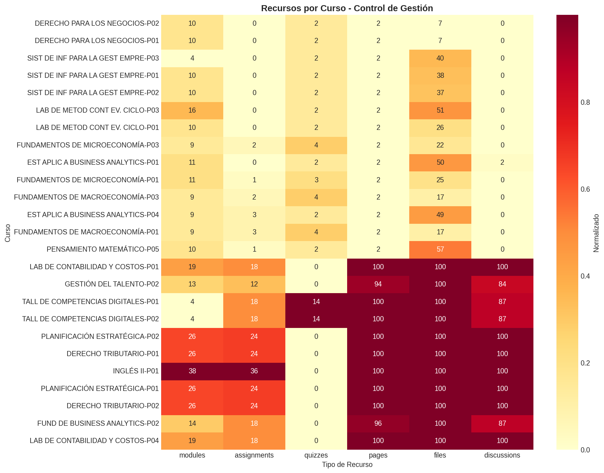
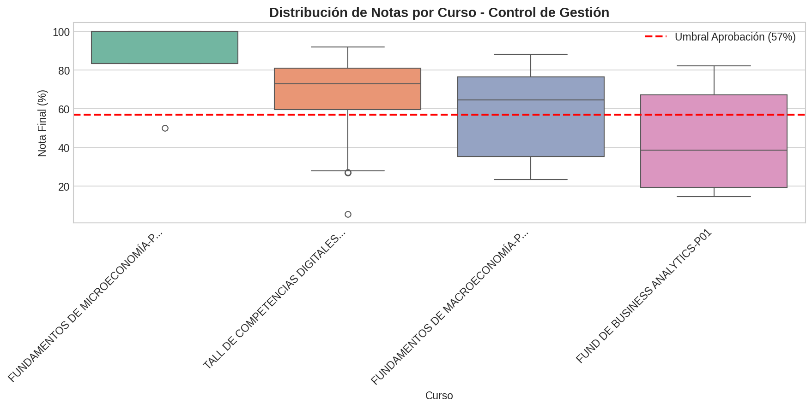
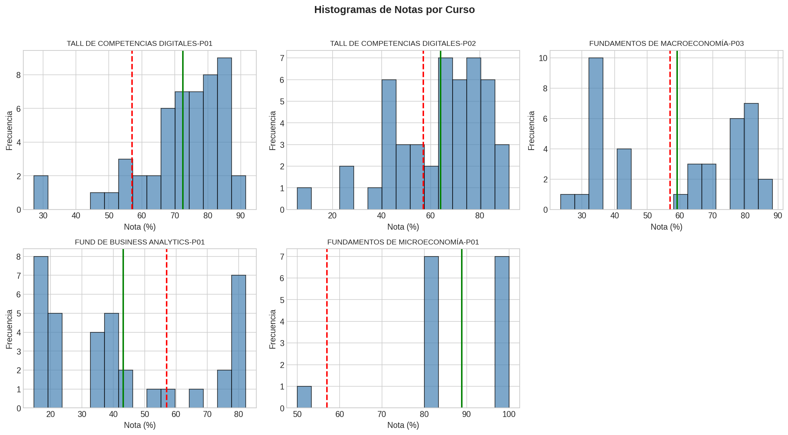
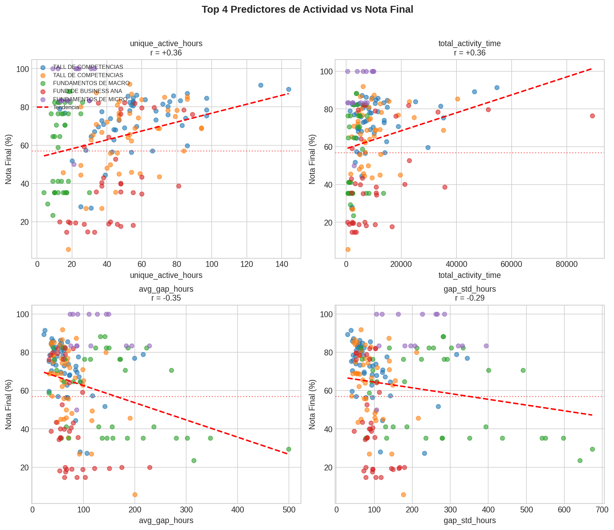
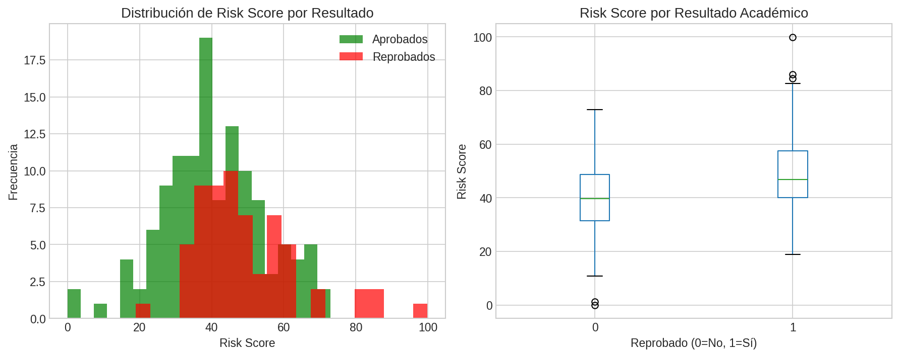

# Diagnóstico: Ingeniería en Control de Gestión
## Universidad Autónoma de Chile - Canvas LMS

**Fecha:** Diciembre 2025
**Programa:** Ingeniería en Control de Gestión (Cuenta 719)
**Ambiente:** TEST (uautonoma.test.instructure.com)

---

## Resumen Ejecutivo

| Métrica | Valor |
|---------|-------|
| Cursos totales | 101 |
| Cursos con estudiantes | 35 |
| Cursos con notas válidas | 5 |
| Estudiantes analizados | 186 |
| Tasa de reprobación promedio | 33.9% |

### Hallazgo Principal

**La actividad en el LMS predice el rendimiento académico.**

Los 4 indicadores más predictivos son:

| Indicador | Correlación | Interpretación |
|-----------|-------------|----------------|
| Horas únicas de actividad | r = +0.36 | Más diversidad = mejor |
| Tiempo total de actividad | r = +0.36 | Más tiempo = mejor |
| Brecha promedio entre sesiones | r = -0.35 | Brechas largas = peor |
| Variabilidad de brechas | r = -0.29 | Irregularidad = riesgo |

---

## Parte 1: Radiografía de Digitalización

### Distribución por Calidad de Diseño

| Categoría | Cursos | Características |
|-----------|--------|----------------|
| Excelente | 15 | >10 módulos, >15 tareas, quizzes |
| Bueno | 17 | 5-10 módulos, 8-15 tareas |
| Básico | 3 | <5 módulos, pocas actividades |

### Top 5 Cursos por Diseño Instruccional

| Curso | Módulos | Tareas | Quizzes | Estudiantes |
|-------|---------|--------|---------|-------------|
| GESTIÓN DEL TALENTO-P01 | 28 | 55 | 7 | 40 |
| INGLÉS II-P01 | 38 | 36 | 0 | 25 |
| PLANIFICACIÓN ESTRATÉGICA-P02 | 26 | 24 | 0 | 39 |
| DERECHO TRIBUTARIO-P01 | 26 | 24 | 0 | 36 |
| PLANIFICACIÓN ESTRATÉGICA-P01 | 26 | 24 | 0 | 29 |



---

## Parte 2: Análisis de Cursos con Notas

### Cursos Analizados

| Curso | N | Media | StdDev | Tasa Aprob |
|-------|---|-------|--------|------------|
| FUND DE BUSINESS ANALYTICS-P01 | 36 | 43.1% | 24.6 | 31% |
| FUNDAMENTOS DE MACROECONOMÍA-P03 | 38 | 59.1% | 21.4 | 58% |
| TALL DE COMPETENCIAS DIGITALES-P02 | 47 | 64.1% | 18.6 | 68% |
| TALL DE COMPETENCIAS DIGITALES-P01 | 50 | 72.4% | 13.9 | 88% |
| FUNDAMENTOS DE MICROECONOMÍA-P01 | 15 | 88.9% | 13.6 | 93% |

### Observaciones

1. **FUND BUSINESS ANALYTICS-P01** tiene la mayor varianza (StdDev = 24.6) y menor tasa de aprobación (31%)
2. **FUND MACROECONOMÍA-P03** muestra varianza significativa (StdDev = 21.4) útil para predicción
3. **FUND MICROECONOMÍA-P01** tiene poca varianza (StdDev = 13.6) - menos útil para predicción





---

## Parte 3: Correlaciones Actividad-Rendimiento

### Features de Actividad Pura (sin data leakage)

| Feature | Corr. Promedio | Consistencia | Accionable |
|---------|----------------|--------------|------------|
| unique_active_hours | +0.36 | Consistente | Monitorear diversidad |
| total_activity_time | +0.36 | Consistente | Rastrear tiempo total |
| avg_gap_hours | -0.35 | Consistente | Alertar brechas largas |
| gap_std_hours | -0.29 | Mixto | Detectar irregularidad |
| afternoon_activity | +0.22 | Mixto | - |
| page_views | +0.21 | Mixto | Métrica básica |

### Validación Externa (Pregrado)

Se validó el modelo en 3 cursos de otras carreras:

| Curso | Carrera | Validación |
|-------|---------|------------|
| ÁLGEBRA-P01 | Ing. Civil Industrial | ✓ Confirma patrones (r hasta +0.55) |
| NEUROCIENCIAS-P01 | Medicina | ✗ Correlaciones débiles |
| SALUD FAM.-P01 | Kinesiología | ✗ Patrones diferentes |

**Conclusión:** Los indicadores funcionan mejor en programas de ingeniería/negocios.



---

## Parte 4: Sistema de Alerta Temprana

### Fórmula de Risk Score

```
risk_score =
  - 0.36 × normalize(unique_active_hours)
  - 0.36 × normalize(total_activity_time)
  + 0.35 × normalize(avg_gap_hours)
  + 0.29 × normalize(gap_std_hours)
```

### Validación del Risk Score

- Correlación con nota final: r = -0.27
- Correlación con reprobación: r = 0.29

### Umbrales Recomendados

| Indicador | Umbral de Alerta | Tasa Reprob. si Riesgo |
|-----------|------------------|------------------------|
| Horas únicas < Q1 | <18 horas | ~60% |
| Tiempo total < Q1 | <2980 seg | ~55% |
| Brecha promedio > Q3 | >109 hrs | ~50% |



---

## Recomendaciones

### Corto Plazo (Inmediato)
1. Implementar alertas cuando brecha de actividad > 72 horas
2. Monitorear estudiantes con < 10 horas únicas de actividad
3. Priorizar cursos con diseño "Básico" para mejora

### Mediano Plazo
1. Dashboard de riesgo por curso y estudiante
2. Intervención piloto en FUND BUSINESS ANALYTICS-P01
3. Capacitar docentes en interpretación de métricas

### Largo Plazo
1. Integrar sistema de alerta con tutoría académica
2. Expandir análisis a más carreras de Pregrado
3. Obtener notas de "Libro de Calificaciones" para cursos sin datos

---

## Anexo: Archivos Generados

| Archivo | Descripción |
|---------|-------------|
| `resource_heatmap.png` | Mapa de recursos por curso |
| `grade_boxplots.png` | Distribución de notas |
| `grade_histograms.png` | Histogramas por curso |
| `top_predictors_scatter.png` | Scatter de predictores |
| `risk_score_distribution.png` | Distribución de riesgo |

---

*Informe generado automáticamente - Diciembre 2025*
