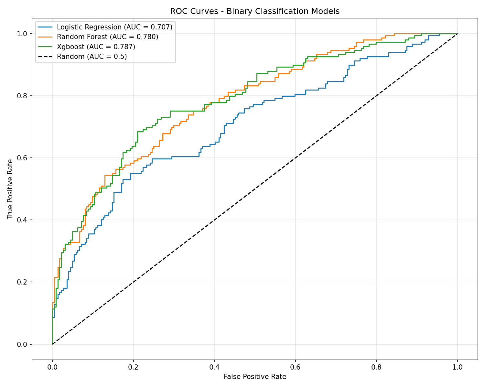
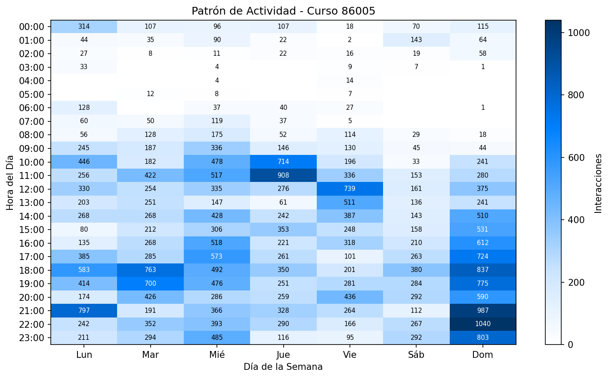
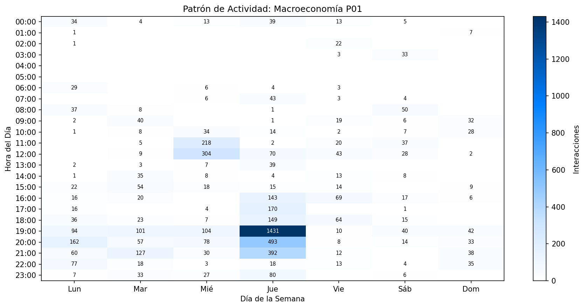
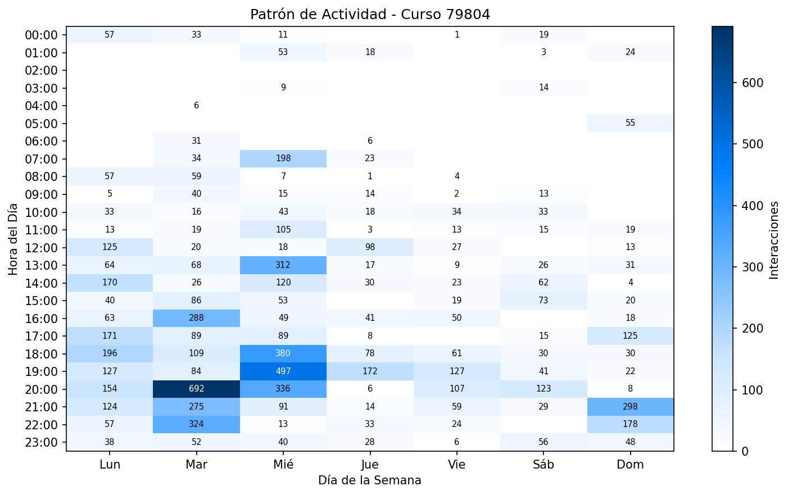

# Informe Ejecutivo: Engagement Estudiantil y Predicción de Fracaso Académico

## Universidad Autónoma de Chile - Canvas LMS

**Fecha:** 30 de diciembre de 2025
**Programa:** Ingeniería en Control de Gestión y otros
**Ambiente:** TEST (uautonoma.test.instructure.com)

---

## Tabla de Contenidos

1. [Resumen Ejecutivo](#1-resumen-ejecutivo)
2. [Radiografía de Cursos](#2-radiografía-de-cursos)
3. [Indicadores de Engagement Digital](#3-indicadores-de-engagement-digital)
4. [Resultados Clave: Factores de Riesgo](#4-resultados-clave-factores-de-riesgo)
5. [Conclusiones y Próximos Pasos](#5-conclusiones-y-próximos-pasos)
6. [Anexos](#6-anexos)

---

# 1. Resumen Ejecutivo

## 1.1 Contexto y Objetivo

La Universidad Autónoma de Chile enfrenta tasas de reprobación significativas en sus programas académicos. Sin un sistema de alerta temprana, los estudiantes en riesgo son identificados demasiado tarde para intervenir efectivamente.

El objetivo de este estudio es evaluar si **los patrones de interacción de los estudiantes con la plataforma Canvas LMS pueden predecir el fracaso académico** antes de que ocurra, permitiendo intervenciones tempranas y oportunas.

## 1.2 Muestra Analizada

Se analizaron **373 estudiantes** distribuidos en **10 cursos** del programa de Ingeniería en Control de Gestión y programas relacionados.

**Criterios de selección de cursos:**
- Cursos con al menos 20 estudiantes matriculados
- Disponibilidad de datos de actividad en Canvas LMS (page views, participaciones)
- Variabilidad suficiente en resultados académicos (tasa de aprobación entre 20% y 80%)
- Exclusión de cursos con escalas de evaluación atípicas o datos incompletos

## 1.3 Variables Analizadas

Se extrajeron indicadores de engagement digital organizados en **7 dimensiones conceptuales**:

| Dimensión | Descripción | Ejemplo |
|-----------|-------------|---------|
| **Regularidad de sesiones** | Con qué frecuencia y consistencia accede el estudiante | Sesiones por semana, días entre accesos |
| **Patrones horarios** | En qué momentos del día estudia | Actividad matutina, vespertina, nocturna |
| **Distribución semanal** | Cómo distribuye el estudio en la semana | Actividad en días laborales vs. fines de semana |
| **Trayectoria de engagement** | Cómo evoluciona su participación en el tiempo | ¿Aumenta, se mantiene o disminuye? |
| **Intensidad de actividad** | Qué tan concentrada o dispersa es su actividad | Variabilidad entre sesiones |
| **Indicadores de procrastinación** | Cuándo inicia el curso y qué tan tarde deja las tareas | Días hasta primer acceso |
| **Volumen de actividad** | Cantidad total de interacciones | Visualizaciones de páginas, participaciones |

## 1.4 Metodología

Se entrenaron tres modelos de aprendizaje automático para predecir el fracaso académico (nota final < 57%):

- **Regresión Logística**: Modelo lineal interpretable
- **Random Forest**: Modelo basado en árboles de decisión
- **XGBoost**: Modelo de gradient boosting (mejor rendimiento)

Los modelos fueron validados con **validación cruzada estratificada de 5 particiones**, asegurando representatividad de aprobados y reprobados en cada partición.

## 1.5 Resultados Principales

### Capacidad Predictiva

El modelo XGBoost logró el mejor rendimiento:

| Métrica | Valor | Interpretación |
|---------|-------|----------------|
| **Área bajo la curva (ROC-AUC)** | 0.787 | Buena capacidad de discriminación |
| **Sensibilidad (Recall)** | 61.7% | Detecta 2 de cada 3 estudiantes en riesgo |
| **Precisión** | 69.7% | 7 de cada 10 alertas son correctas |

### Factores de Riesgo Identificados

Se identificaron **8 factores de riesgo estadísticamente significativos** (p < 0.05):

| Factor de Riesgo | Riesgo Relativo |
|------------------|-----------------|
| Baja frecuencia de sesiones semanales | **2.01x** mayor probabilidad de reprobar |
| Pocas visualizaciones de páginas | **1.93x** |
| Pocas sesiones de estudio totales | **1.82x** |
| Sin actividad en fines de semana | **1.81x** |
| Sin estudio en horario vespertino | **1.76x** |
| Pocas horas activas en el curso | **1.71x** |
| Gap prolongado entre sesiones | **1.64x** |
| Pocos días activos en el curso | **1.64x** |

## 1.6 Conclusiones y Trabajo Futuro

### Conclusiones Principales

1. **El engagement digital predice el éxito académico**: Los patrones de interacción con Canvas LMS tienen valor predictivo significativo sobre el rendimiento final.

2. **La frecuencia importa más que la duración**: Estudiantes que acceden regularmente (aunque sea por períodos cortos) tienen mejores resultados que quienes estudian esporádicamente por períodos largos.

3. **Los patrones son detectables tempranamente**: Las señales de riesgo son observables desde las primeras semanas del curso, antes de las primeras evaluaciones.

4. **Hallazgo principal**: Los estudiantes con menos de 2 sesiones por semana tienen el **DOBLE de probabilidad de reprobar** (53.2% vs 26.5%).

### Trabajo Futuro

- **Piloto de Sistema de Alerta Temprana**: Implementar alertas automáticas basadas en los 8 factores de riesgo
- **Validación en otros programas**: Extender el análisis a Postgrado y otras carreras
- **Intervenciones personalizadas**: Diseñar estrategias de apoyo específicas según el patrón de riesgo detectado
- **Integración institucional**: Incorporar el sistema en los procesos de seguimiento académico

---

# 2. Radiografía de Cursos

Esta sección presenta una visión integral de los cursos analizados: su diseño instruccional, patrones de actividad estudiantil y estadísticas de rendimiento.

## 2.1 Diseño Instruccional en LMS

El diseño instruccional define la arquitectura pedagógica de cada curso en Canvas: módulos, tareas, cuestionarios, archivos, foros de discusión y páginas informativas.

### Composición de Recursos por Curso


### Distribución por Tipo de Recurso

| Curso | Módulos | Tareas | Quizzes | Archivos | Discusiones | Páginas | **Total** |
|-------|---------|--------|---------|----------|-------------|---------|-----------|
| GESTIÓN DEL TALENTO-P01 | 13 | 35 | 5 | 320 | 245 | 401 | **1,019** |
| TALL DE COMPETENCIAS DIGITALES-P01 | 4 | 18 | 14 | 356 | 87 | 160 | **639** |
| TALL DE COMPETENCIAS DIGITALES-P02 | 4 | 18 | 14 | 356 | 87 | 160 | **639** |
| FUND DE BUSINESS ANALYTICS-P01 | 15 | 24 | 0 | 125 | 86 | 109 | **359** |
| FUNDAMENTOS TRIBUTARIOS-P01 | 13 | 15 | 3 | 94 | 91 | 128 | **344** |
| MATEMÁTICAS PARA LOS NEGOCIOS-P01 | 10 | 9 | 2 | 26 | 0 | 2 | **49** |
| FUNDAMENTOS DE MICROECONOMÍA-P01 | 11 | 1 | 3 | 25 | 0 | 2 | **42** |
| FUNDAMENTOS DE MACROECONOMÍA-P03 | 9 | 2 | 4 | 17 | 0 | 2 | **34** |

### Hallazgo Clave: Disparidad Extrema

> **Existe una brecha de 30x entre el curso más rico en recursos (1,019) y el más austero (34)**, indicando la ausencia de estándares institucionales uniformes para el diseño instruccional.

### Clasificación por Complejidad

| Categoría | Recursos | Cursos |
|-----------|----------|--------|
| **Diseño Complejo** | >500 | Gestión del Talento, Competencias Digitales |
| **Diseño Moderado** | 100-500 | Business Analytics, Tributarios |
| **Diseño Simple** | <100 | Economía, Matemáticas |

---

## 2.2 Patrones de Actividad Estudiantil

### Comparación de Actividad por Curso


### Métricas de Engagement

| Curso | Estudiantes | Views | Views/Estudiante | Participaciones |
|-------|-------------|-------|------------------|-----------------|
| TALL DE COMPETENCIAS DIGITALES-P01 | 50 | 37,593 | **752** | 555 |
| TALL DE COMPETENCIAS DIGITALES-P02 | 51 | 36,956 | **725** | 572 |
| FUND DE BUSINESS ANALYTICS-P01 | 40 | 21,457 | 536 | 121 |
| FUNDAMENTOS DE MICROECONOMÍA-P03 | 42 | 8,122 | 193 | 43 |
| GESTIÓN DEL TALENTO-P01 | 33 | 7,646 | 232 | 72 |
| FUNDAMENTOS DE MICROECONOMÍA-P01 | 38 | 5,815 | **153** | 12 |

### La Paradoja del Volumen vs. Engagement


> **Hallazgo Contra-intuitivo:** El curso con más recursos (Gestión del Talento: 1,019 recursos) tiene engagement relativamente bajo (232 views/estudiante), mientras que cursos balanceados (Competencias Digitales: 639 recursos) logran el máximo engagement (752 views/estudiante).
>
> **Conclusión: Más contenido no significa mejor aprendizaje.**

---

## 2.3 Patrones Temporales de Conexión

Los heatmaps muestran cuándo se conectan los estudiantes (hora del día × día de la semana).


### Hallazgos Clave

| Patrón | Observación |
|--------|-------------|
| **Pico de actividad** | 18:00 - 22:00 (horarios vespertinos post-laborales) |
| **Fin de semana** | Actividad significativa en cursos con alto engagement |
| **Madrugada** | Mínima actividad (00:00-06:00) en todos los cursos |
| **Lunes vs Viernes** | Mayor actividad al inicio de semana |

---

## 2.4 Estadísticas de Rendimiento Académico

### Distribución de Notas por Curso


*\* El curso 89736 (Macroecon.) utiliza una escala de puntuación diferente (0-28 puntos). Las notas fueron normalizadas a escala 0-100 para comparabilidad. Ver Anexo D para detalles.*

### Tasas de Aprobación


### Resumen de Rendimiento

| Curso ID | Estudiantes | Promedio | Tasa Aprobación |
|----------|-------------|----------|-----------------|
| 89390 | 33 | 76.0 | **78.8%** |
| 79913 | 41 | 65.4 | 73.2% |
| 84936 | 42 | 68.9 | 71.4% |
| 86020 | 51 | 59.1 | 62.7% |
| 79875 | 32 | 58.8 | 59.4% |
| 84944 | 40 | 56.2 | 55.0% |
| 84941 | 38 | 35.1 | 36.8% |
| 86676 | 40 | 38.8 | **27.5%** |

**Rango de tasas de aprobación:** 27.5% - 78.8%
**Tasa promedio global:** 60.1%

---

# 3. Indicadores de Engagement Digital

Para predecir el éxito académico, desarrollamos **54 indicadores** que capturan diferentes dimensiones del comportamiento estudiantil en el LMS. Esta sección explica conceptualmente qué medimos y por qué importa.

## Marco Conceptual

Nuestros indicadores se fundamentan en dos modelos teóricos establecidos en la literatura educativa:

**Modelo de Fredricks, Blumenfeld y Paris (2004)** - El engagement estudiantil tiene tres dimensiones:
- **Conductual**: Lo que el estudiante HACE (asistencia, participación, esfuerzo visible)
- **Emocional**: Cómo se SIENTE respecto al aprendizaje (interés, compromiso voluntario)
- **Cognitivo**: Cómo se IMPLICA mentalmente (autorregulación, estrategias de aprendizaje)

**Ciclo de Aprendizaje Autorregulado de Zimmerman (2000)** - El aprendizaje efectivo es un ciclo de tres fases:
- **Planificación**: Establecer metas, organizar el tiempo, anticipar tareas
- **Ejecución**: Mantener atención, aplicar estrategias, monitorear el progreso
- **Autorreflexión**: Evaluar resultados, adaptar estrategias, aprender de errores

A continuación, cada dimensión de indicadores se vincula con estos marcos teóricos.

## 3.1 Regularidad de Sesiones de Estudio

> **Dimensión teórica:** Engagement Conductual (Fredricks) + Fase de Ejecución (Zimmerman)

### ¿Qué medimos?
**Con qué frecuencia y consistencia el estudiante accede al curso.**

Una "sesión" se define como un período de actividad continua en el LMS, donde cada pausa mayor a 30 minutos inicia una nueva sesión.

### Analogía
> Es como medir si un estudiante asiste regularmente a clases (3-4 veces por semana) versus aparece esporádicamente (1 vez cada 10 días).

### Indicadores Clave
- **Sesiones por semana:** Promedio de sesiones de estudio semanales
- **Intervalo promedio entre sesiones:** Días/horas entre accesos consecutivos
- **Regularidad de sesiones:** Qué tan predecible es el patrón de acceso

### Por Qué Importa
Esta dimensión captura lo que el estudiante HACE de forma observable (engagement conductual) y su capacidad de mantener un ritmo de estudio consistente (fase de ejecución en el ciclo de autorregulación).

> **Los estudiantes con menos de 2 sesiones por semana tienen el DOBLE de probabilidad de reprobar.**

---

## 3.2 Patrones de Hora del Día

> **Dimensión teórica:** Engagement Emocional (Fredricks)

### ¿Qué medimos?
**Cuándo estudia el estudiante: mañana, tarde, noche o madrugada.**

### Franjas Horarias
| Bloque | Horario |
|--------|---------|
| Mañana | 06:00 - 12:00 |
| Tarde | 12:00 - 18:00 |
| Noche/Vespertino | 18:00 - 24:00 |
| Madrugada | 00:00 - 06:00 |

### Por Qué Importa
El estudio en horarios vespertinos (fuera del horario académico formal) refleja compromiso voluntario con el aprendizaje, un indicador de engagement emocional positivo.

> **El estudio vespertino (6pm-10pm) reduce el riesgo de fracaso en 44%.** Los estudiantes que estudian en horarios vespertinos muestran mayor compromiso académico.

---

## 3.3 Distribución Semanal

> **Dimensión teórica:** Engagement Emocional (Fredricks)

### ¿Qué medimos?
**Cómo distribuye el estudiante su estudio entre días laborales y fines de semana.**

### Indicadores Clave
- Porcentaje de actividad en días laborales vs. fines de semana
- Actividad los sábados y domingos

### Por Qué Importa
Estudiar en fines de semana implica dedicar tiempo personal voluntario al aprendizaje, lo cual refleja un vínculo emocional positivo con los estudios y un interés genuino más allá de las obligaciones formales.

> **El estudio en fines de semana reduce el riesgo de fracaso en 45%.** Los estudiantes que dedican tiempo voluntario demuestran mayor compromiso con su aprendizaje.

---

## 3.4 Trayectoria de Engagement

> **Dimensión teórica:** Engagement Cognitivo (Fredricks) + Fase de Autorreflexión (Zimmerman)

### ¿Qué medimos?
**Cómo evoluciona el compromiso del estudiante a lo largo del semestre.**

### Tipos de Trayectorias
| Tipo | Descripción | Implicación |
|------|-------------|-------------|
| **Creciente** | Engagement aumenta con el tiempo | Estudiante que "despega" |
| **Estable** | Engagement constante | Estudiante disciplinado |
| **Decreciente** | Engagement disminuye | Señal de alerta temprana |
| **Errático** | Engagement irregular | Estudiante desorganizado |

### Por Qué Importa
La capacidad de mantener o aumentar el engagement refleja autorregulación cognitiva: el estudiante evalúa su desempeño y adapta su comportamiento. Una trayectoria decreciente indica falta de adaptación ante dificultades.

> **Los estudiantes con engagement decreciente tienen 40% más riesgo de fracaso.** La trayectoria es un indicador temprano de problemas.

---

## 3.5 Dinámica de Intensidad

> **Dimensión teórica:** Engagement Cognitivo (Fredricks) + Fase de Ejecución (Zimmerman)

### ¿Qué medimos?
**Variabilidad en el esfuerzo: picos y valles de actividad semanal.**

### Indicadores Clave
- Número de semanas con picos de actividad
- Variabilidad semana-a-semana
- Respuesta a eventos del curso (deadlines, exámenes)

### Hallazgo Contra-intuitivo
Esta dimensión mide la capacidad del estudiante de ajustar su esfuerzo según las demandas del curso, lo cual requiere monitoreo activo y estrategias de estudio flexibles.

> **Los estudiantes con cierta variabilidad en su esfuerzo obtienen mejores resultados que aquellos con actividad completamente plana.** Esto sugiere que responden a las demandas del curso (más estudio antes de exámenes) en lugar de mantener un esfuerzo mínimo constante.

---

## 3.6 Indicadores de Procrastinación

> **Dimensión teórica:** Fase de Planificación (Zimmerman)

### ¿Qué medimos?
**Qué tan temprano comienza el estudiante a interactuar con el curso.**

### Indicadores Clave
- Días hasta el primer acceso al curso
- Días hasta acceder al primer módulo
- Patrón de acceso inicial

### Por Qué Importa
El inicio temprano refleja la fase de planificación del ciclo de autorregulación: establecer metas, organizar el tiempo y anticipar las demandas del curso. Los estudiantes que postergan el inicio demuestran dificultades en esta fase crítica.

> Los estudiantes que comienzan tarde tienen mayor riesgo, aunque este factor es menos determinante que la frecuencia de sesiones.

---

## 3.7 Conteos de Actividad

> **Dimensión teórica:** Engagement Conductual (Fredricks)

### ¿Qué medimos?
**Volumen total de interacción con el LMS.**

### Indicadores Clave
- **Total de visualizaciones de página:** Cuántas veces accede a contenido
- **Total de participaciones:** Posts en foros, entregas de tareas, intentos de quiz
- **Días activos:** Cuántos días diferentes mostró actividad
- **Horas activas únicas:** Diversidad temporal de la actividad

### Por Qué Importa
Estos indicadores capturan la dimensión más básica del engagement conductual: las acciones observables del estudiante en el sistema. La participación activa (no solo navegación pasiva) es un indicador directo de involucramiento con el curso.

> **Las participaciones son el predictor individual más fuerte.** Los estudiantes que participan activamente (foros, tareas, quizzes) tienen significativamente mejores resultados que los que solo "navegan" pasivamente.

---

## Resumen: Las 7 Dimensiones del Engagement

```
┌─────────────────────────────────────────────────────────────┐
│           7 DIMENSIONES DEL ENGAGEMENT DIGITAL              │
├─────────────────────────────────────────────────────────────┤
│  1. REGULARIDAD DE SESIONES    │  ¿Con qué frecuencia?      │
│  2. PATRONES HORARIOS          │  ¿A qué hora?              │
│  3. DISTRIBUCIÓN SEMANAL       │  ¿Qué días?                │
│  4. TRAYECTORIA                │  ¿Cómo evoluciona?         │
│  5. DINÁMICA DE INTENSIDAD     │  ¿Cómo varía el esfuerzo?  │
│  6. PROCRASTINACIÓN            │  ¿Cuándo comienza?         │
│  7. VOLUMEN DE ACTIVIDAD       │  ¿Cuánto participa?        │
└─────────────────────────────────────────────────────────────┘
```

---

# 4. Resultados Clave: Factores de Riesgo

Esta sección presenta los **8 factores de riesgo estadísticamente significativos** que distinguen a estudiantes que aprueban de aquellos que reprueban.

## 4.1 Los 8 Factores de Riesgo (p < 0.05)


### Tabla de Factores de Riesgo

| # | Factor de Riesgo | Riesgo Relativo | Tasa Fracaso (Bajo) | Tasa Fracaso (Alto) | p-value |
|---|------------------|-----------------|---------------------|---------------------|---------|
| 1 | **Baja frecuencia de sesiones/semana** | **2.01x** | 53.2% | 26.5% | <0.001 |
| 2 | Bajo total de visualizaciones | 1.93x | 52.4% | 27.2% | <0.001 |
| 3 | Bajo número de sesiones totales | 1.82x | 51.3% | 28.3% | <0.001 |
| 4 | Pocas horas activas únicas | 1.82x | 51.3% | 28.3% | <0.001 |
| 5 | Sin estudio en fines de semana | 1.81x | 48.5% | 26.7% | <0.001 |
| 6 | Sin estudio vespertino (6pm-10pm) | 1.76x | 57.0% | 32.4% | <0.001 |
| 7 | Amplios intervalos entre sesiones | 1.62x | 49.5% | 30.5% | <0.001 |
| 8 | Engagement decreciente | 1.40x | 46.5% | 33.3% | <0.05 |

---

## 4.2 Comparación Visual: Aprobados vs. Reprobados


### Diferencias Observadas

| Métrica | Aprobados | Reprobados | Diferencia |
|---------|-----------|------------|------------|
| **Sesiones totales** | Mediana ~35 | Mediana ~15 | 2.3x mayor |
| **Sesiones/semana** | Mediana ~2.5 | Mediana ~1.5 | 67% mayor |
| **Page views** | Mediana ~700 | Mediana ~300 | 2.3x mayor |
| **Horas activas** | Mediana ~40 | Mediana ~20 | 2x mayor |
| **Gap entre sesiones** | Máx ~400 | Outliers hasta 700+ | Dramática diferencia |

### Hallazgo Visual Impactante

> En el gráfico de "Gap entre Sesiones", los estudiantes **aprobados** muestran intervalos máximos de aproximadamente ~400 unidades, mientras que los **reprobados** tienen múltiples casos con gaps de 500, 600 e incluso 700+. Esto ilustra visualmente cómo la **irregularidad extrema** en el acceso está asociada con el fracaso.

---

## 4.3 Umbrales Críticos Memorizables

Para facilitar la implementación de alertas, estos son los umbrales prácticos:

```
┌─────────────────────────────────────────────────────────────┐
│                 UMBRALES DE ALERTA TEMPRANA                 │
├─────────────────────────────────────────────────────────────┤
│                                                             │
│  ⚠️  < 2 sesiones/semana      → DOBLE riesgo de reprobar   │
│                                                             │
│  ⚠️  Sin actividad los fines  → 81% más riesgo             │
│      de semana                                              │
│                                                             │
│  ⚠️  > 5 días promedio entre  → 62% más riesgo             │
│      sesiones                                               │
│                                                             │
│  ⚠️  Engagement decreciente   → 40% más riesgo             │
│      durante el semestre                                    │
│                                                             │
└─────────────────────────────────────────────────────────────┘
```

---

## 4.4 Perfil del Estudiante en Riesgo

### Estudiante Típico en Riesgo

> El estudiante en riesgo accede al LMS **menos de 2 veces por semana**, con largos intervalos entre sesiones (promedio >5 días). **No estudia los fines de semana**, evita los horarios vespertinos, y muestra un **declive en su engagement** a lo largo del semestre. Cuando accede, principalmente "navega" pasivamente sin participar activamente en foros o tareas.

### Estudiante Típico Exitoso

> El estudiante exitoso accede al LMS **3-4 veces por semana** de forma consistente. Estudia en **horarios vespertinos** (6pm-10pm) y dedica tiempo los **fines de semana**. Muestra engagement **estable o creciente** durante el semestre y **participa activamente** en foros y actividades del curso.

---

## 4.5 Capacidad Predictiva del Modelo

### Rendimiento del Modelo XGBoost

| Métrica | Valor | Interpretación |
|---------|-------|----------------|
| **ROC-AUC** | 0.787 | Buena capacidad discriminativa |
| **Precisión** | 69.7% | 7 de 10 alertas son correctas |
| **Sensibilidad (Recall)** | 61.7% | Detectamos 2 de cada 3 en riesgo |
| **Exactitud** | 74.0% | 3 de 4 predicciones correctas |



### ¿Qué Significa en la Práctica?

> De **100 estudiantes realmente en riesgo**, nuestro sistema identificaría correctamente a **62**. De los 38 no detectados, la mayoría tendría puntajes de riesgo cercanos al umbral.
>
> De **100 alertas generadas**, aproximadamente **70 serían correctas** (verdaderos positivos).

### Ventaja Temporal

| Método | Cuándo Está Disponible |
|--------|------------------------|
| Intuición docente | Variable, no sistemático |
| Primera evaluación | Semana 4-6 (ya es tarde) |
| **Modelo LMS** | **Semana 2-3 del curso** |

---

# 5. Conclusiones y Próximos Pasos

## 5.1 Conclusiones Principales

### 1. El engagement digital predice el éxito académico
Los patrones de interacción con el LMS son predictores confiables del rendimiento. Con un ROC-AUC de 0.787, el modelo demuestra capacidad discriminativa sólida.

### 2. La frecuencia y consistencia importan más que la duración
No se trata de cuántas horas totales pasa un estudiante en el LMS, sino de **con qué frecuencia y regularidad** accede. Sesiones cortas pero frecuentes superan a sesiones largas pero esporádicas.

### 3. Los patrones son medibles y accionables
Los 8 factores de riesgo identificados son **observables en tiempo real** desde los datos del LMS, permitiendo intervenciones proactivas.

### 4. La intervención temprana es posible
El modelo permite identificar estudiantes en riesgo desde la **semana 2-3 del curso**, mucho antes de la primera evaluación formal.

---

## 5.2 Recomendaciones Estratégicas

### Corto Plazo (Inmediato)

| Acción | Descripción |
|--------|-------------|
| **Sistema de alertas** | Implementar alertas automáticas basadas en los 8 factores de riesgo |
| **Dashboard para docentes** | Visualización en tiempo real del engagement de sus estudiantes |
| **Capacitación** | Entrenar personal académico en interpretación de indicadores |
| **Protocolos de intervención** | Establecer procedimientos diferenciados según nivel de riesgo |

### Mediano Plazo (Próximo Semestre)

| Acción | Descripción |
|--------|-------------|
| **Expansión** | Extender análisis a todos los cursos de pregrado |
| **Variables adicionales** | Integrar historial académico y factores socioeconómicos |
| **Evaluación de efectividad** | Medir impacto de intervenciones en tasas de aprobación |
| **Refinamiento del modelo** | Ajustar umbrales según resultados reales |

### Largo Plazo (Institucional)

| Acción | Descripción |
|--------|-------------|
| **Plataforma integral** | Desarrollar sistema completo de analítica estudiantil |
| **Investigación** | Publicar resultados en revistas académicas |
| **Escalamiento** | Aplicar modelo a retención y deserción |
| **Colaboración** | Alianzas con otras instituciones para validación cruzada |

---

## 5.3 Propuesta de Continuación

### Objetivo Inmediato
Implementar un **piloto del Sistema de Alerta Temprana** en 3-5 cursos durante el próximo semestre.

### Recursos Necesarios
- Acceso a datos de Canvas en tiempo real
- Desarrollo de dashboard de visualización
- Capacitación a 5-10 docentes piloto
- Diseño de protocolos de intervención

### Métricas de Éxito
- Reducción de tasa de reprobación en cursos piloto
- Tiempo promedio de respuesta a alertas
- Satisfacción de docentes con el sistema
- Percepción estudiantil de apoyo académico

---

# 6. Anexos

## Anexo A: Radiografía Digital de Cursos

### Heatmaps de Actividad por Curso

Los siguientes mapas de calor muestran la distribución horaria de la actividad estudiantil (24 horas x 7 días de la semana) para cada curso analizado:

| Curso | Heatmap |
|-------|---------|
| TALL DE COMPETENCIAS DIGITALES-P01 (86005) |  |
| TALL DE COMPETENCIAS DIGITALES-P02 (86020) |  |
| FUND DE BUSINESS ANALYTICS-P01 (86676) |  |
| FUND. DE BUSINESS ANALYTICS-P01 (79913) |  |
| FUNDAMENTOS DE MICROECONOMÍA-P03 (84936) |  |
| FUNDAMENTOS DE MICROECONOMÍA-P01 (84941) |  |
| FUNDAMENTOS DE MACROECONOMÍA-P03 (84944) |  |
| FUNDAMENTOS DE MACROECONOMÍA-P01 (89736) |  |
| FUNDAMENTOS TRIBUTARIOS-P01 (79804) |  |
| TALLER DE COMP DIGITALES-P01 (79875) |  |
| TALLER DE COMP DIGITALES-P01 (89099) |  |
| MATEMÁTICAS PARA LOS NEGOCIOS-P01 (88381) |  |
| GESTIÓN DEL TALENTO-P01 (89390) |  |

---

## Anexo B: Resultados por Curso

### Clasificación por Patrones de Rendimiento

#### Cursos de Alto Rendimiento (Tasa de Aprobación > 70%)

| Curso | Estudiantes | Promedio | Tasa Aprobación |
|-------|-------------|----------|-----------------|
| GESTIÓN DEL TALENTO-P01 | 33 | 76.0 | 78.8% |
| FUND. DE BUSINESS ANALYTICS-P01 | 41 | 65.4 | 73.2% |
| FUNDAMENTOS DE MICROECONOMÍA-P03 | 42 | 68.9 | 71.4% |
| MATEMÁTICAS PARA LOS NEGOCIOS-P01 | 21 | 68.5 | 71.4% |
| TALLER DE COMP DIGITALES-P01 | 35 | 61.1 | 71.4% |

#### Cursos de Rendimiento Medio (Tasa 55-70%)

| Curso | Estudiantes | Promedio | Tasa Aprobación |
|-------|-------------|----------|-----------------|
| TALL DE COMPETENCIAS DIGITALES-P02 | 51 | 59.1 | 62.7% |
| TALLER DE COMP DIGITALES-P01 | 32 | 58.8 | 59.4% |
| FUNDAMENTOS DE MACROECONOMÍA-P03 | 40 | 56.2 | 55.0% |

#### Cursos de Bajo Rendimiento (Tasa < 55%)

| Curso | Estudiantes | Promedio | Tasa Aprobación |
|-------|-------------|----------|-----------------|
| FUNDAMENTOS DE MICROECONOMÍA-P01 | 38 | 35.1 | 36.8% |
| FUND DE BUSINESS ANALYTICS-P01 | 40 | 38.8 | 27.5% |

---

## Anexo C: Comparación de Modelos Predictivos

Se evaluaron tres modelos de aprendizaje automático para predecir el fracaso académico:

### Resultados Comparativos

| Modelo | Exactitud | Precisión | Sensibilidad | Puntaje F1 | Área Bajo la Curva |
|--------|-----------|-----------|--------------|------------|-------------------|
| Regresión Logística | 65.1% | 55.9% | 60.4% | 58.1% | 0.707 |
| Random Forest | 72.9% | 70.3% | 55.7% | 62.2% | 0.780 |
| **XGBoost** | **74.0%** | **69.7%** | **61.7%** | **65.5%** | **0.787** |

### Explicación de las Métricas

| Métrica | ¿Qué significa? | Interpretación en este contexto |
|---------|-----------------|--------------------------------|
| **Exactitud** | Porcentaje de predicciones correctas totales | De todos los estudiantes, ¿cuántos clasificamos correctamente? |
| **Precisión** | De los alertados como "en riesgo", ¿cuántos realmente reprueban? | Evita alertas falsas innecesarias |
| **Sensibilidad** | De los que reprueban, ¿cuántos detectamos? | Capacidad de capturar estudiantes en riesgo |
| **Puntaje F1** | Balance entre Precisión y Sensibilidad | Métrica resumen de rendimiento |
| **Área Bajo la Curva** | Capacidad general de discriminar entre aprobados y reprobados | Valores > 0.7 indican buen rendimiento |

### Interpretación del Modelo Seleccionado (XGBoost)

- **Sensibilidad del 61.7%**: El modelo detecta correctamente **2 de cada 3** estudiantes que van a reprobar
- **Precisión del 69.7%**: De cada 10 alertas generadas, **7 son correctas**
- **Área Bajo la Curva de 0.787**: Indica una **buena capacidad de discriminación** entre estudiantes que aprobarán y reprobarán

---

## Anexo D: Notas sobre Cursos Excluidos

### Curso 89736: FUNDAMENTOS DE MACROECONOMÍA-P01

Este curso fue excluido del análisis principal debido a una **escala de evaluación atípica**:

| Característica | Valor Observado |
|----------------|-----------------|
| Estudiantes | 28 |
| Nota máxima registrada | 28.3 puntos |
| Nota promedio | 17.5 puntos |
| Tasa de aprobación (umbral 57%) | 0% |

**Análisis:** Las notas del curso aparecen en una escala de 0-28 puntos en lugar de 0-100. Al normalizar las notas a escala 0-100:

| Nota Original | Nota Normalizada |
|---------------|------------------|
| 28.3 | 100% |
| 22.0 | 78% |
| 5.0 | 18% |
| 0.0 | 0% |

Con la escala normalizada, la tasa de aprobación sería aproximadamente **67.9%** (19 de 28 estudiantes), lo cual es consistente con otros cursos similares.

**Recomendación:** Revisar la configuración de puntuación de este curso en Canvas para asegurar consistencia con la escala institucional estándar.

---

*Informe generado el 30 de diciembre de 2025*
*Universidad Autónoma de Chile - Canvas LMS*
*Ambiente: TEST (uautonoma.test.instructure.com)*
