# Reporte Técnico: Análisis Predictivo de Fracaso Estudiantil
## Universidad Autónoma de Chile - Canvas LMS

**Fecha de generación:** 28 de diciembre de 2025
**Programa analizado:** Ingeniería en Control de Gestión y otros
**Ambiente:** TEST (uautonoma.test.instructure.com)

---

## Tabla de Contenidos

1. [Resumen Ejecutivo](#resumen-ejecutivo)
2. [Metodología de Selección de Cursos](#metodología-de-selección-de-cursos)
3. [Radiografía del Diseño Instruccional LMS](#radiografía-del-diseño-instruccional-lms)
4. [Actividad Estudiantil y Engagement](#actividad-estudiantil-y-engagement)
5. [Fuentes de Datos](#fuentes-de-datos)
6. [Ingeniería de Features](#ingeniería-de-features)
7. [Metodología de Modelos Predictivos](#metodología-de-modelos-predictivos)
8. [Resultados Generales](#resultados-generales)
9. [Insights Accionables](#insights-accionables)
10. [Análisis por Curso](#análisis-por-curso)
11. [Conclusiones y Recomendaciones](#conclusiones-y-recomendaciones)

---

## 1. Resumen Ejecutivo

# RESUMEN EJECUTIVO

## Análisis Predictivo de Fracaso Estudiantil mediante Machine Learning

### Objetivo
Este estudio desarrolló un modelo predictivo para identificar estudiantes en riesgo académico utilizando datos de engagement extraídos de Canvas LMS, con el propósito de implementar intervenciones tempranas y mejorar las tasas de retención estudiantil.

### Metodología
Se analizaron 373 estudiantes de 10 cursos académicos diversos, extrayendo 54 características de engagement digital. Se implementó un modelo XGBoost para predicción de fracaso estudiantil, evaluando su rendimiento mediante métricas estándar de clasificación y realizando análisis estadístico de factores de riesgo.

### Hallazgos Principales
El modelo alcanzó un ROC-AUC de 0.787, demostrando capacidad predictiva sólida con un recall del 61.7%, permitiendo identificar dos de cada tres estudiantes en riesgo. La tasa de aprobación global observada fue del 60.1%.

El análisis identificó cinco factores de riesgo estadísticamente significativos (p < 0.05):

- **Sesiones por semana**: Factor más crítico (RR = 2.01)
- **Total de visualizaciones de página**: Segundo predictor más fuerte (RR = 1.93)
- **Total de sesiones de estudio**: Altamente predictivo (RR = 1.82)
- **Horas activas únicas**: Indicador clave de engagement (RR = 1.82)
- **Estudio en fines de semana**: Factor diferenciador significativo (RR = 1.81)

### Implicaciones
Los resultados evidencian que los patrones de engagement digital son predictores confiables del rendimiento académico. La frecuencia y consistencia de interacción con la plataforma superan en importancia a la duración absoluta de estudio. El modelo proporciona una herramienta viable para sistemas de alerta temprana, permitiendo intervenciones oportunas para mejorar el éxito estudiantil.

### Recomendación
Implementar el modelo en producción para monitoreo continuo de estudiantes en riesgo, complementado con estrategias de intervención basadas en los factores identificados.

---

## 2. Metodología de Selección de Cursos

### Tabla de Referencia de Cursos

Para facilitar la navegación transversal del documento, todos los gráficos utilizan el formato **"NombreCorto (ID)"** o solo **"Curso ID"**. La siguiente tabla proporciona el mapeo completo:

| ID | Nombre Completo | Abreviatura |
|----|-----------------|-------------|
| 79804 | FUNDAMENTOS TRIBUTARIOS-P01 | Tributarios |
| 79875 | TALLER DE COMP DIGITALES-P01 | Comp.Dig. |
| 79913 | FUND. DE BUSINESS ANALYTICS-P01 | Bus.Analytics |
| 84936 | FUNDAMENTOS DE MICROECONOMÍA-P03 | Microecon. |
| 84941 | FUNDAMENTOS DE MICROECONOMÍA-P01 | Microecon. |
| 84944 | FUNDAMENTOS DE MACROECONOMÍA-P03 | Macroecon. |
| 86005 | TALL DE COMPETENCIAS DIGITALES-P01 | Comp.Dig. |
| 86020 | TALL DE COMPETENCIAS DIGITALES-P02 | Comp.Dig. |
| 86676 | FUND DE BUSINESS ANALYTICS-P01 | Bus.Analytics |
| 88381 | MATEMÁTICAS PARA LOS NEGOCIOS-P01 | Mat.Negocios |
| 89099 | TALLER DE COMP DIGITALES-P01 | Comp.Dig. |
| 89390 | GESTIÓN DEL TALENTO-P01 | Gest.Talento |
| 89736 | FUNDAMENTOS DE MACROECONOMÍA-P01 | Macroecon. |

*Nota: Cursos con el mismo nombre pero diferentes IDs corresponden a secciones paralelas distintas.*

# METODOLOGÍA DE SELECCIÓN DE CURSOS

## Criterios de Inclusión

Para garantizar la validez y confiabilidad del análisis, se establecieron criterios específicos para la selección de cursos que permitan evaluar adecuadamente el impacto de las intervenciones pedagógicas. Los criterios aplicados fueron los siguientes:

### 1. Diversidad de Rendimiento Académico
Se seleccionaron cursos con tasas de aprobación entre 20% y 80% para evitar efectos extremos que comprometan el análisis:
- **Límite inferior (20%)**: Elimina cursos donde prácticamente todos los estudiantes reprueban, indicando posibles problemas estructurales en el diseño del curso o evaluación inadecuada.
- **Límite superior (80%)**: Excluye cursos con efecto techo, donde la mayoría aprueba sin dificultad, limitando la capacidad de detectar mejoras significativas.

### 2. Variabilidad en las Calificaciones
Se requirió una desviación estándar mínima de 10% en las calificaciones para asegurar suficiente dispersión en el rendimiento estudiantil. Este criterio garantiza que existe variabilidad real en el aprendizaje, permitiendo identificar patrones diferenciados de desempeño.

### 3. Tamaño Muestral Adecuado
Se estableció un mínimo de 20 estudiantes por curso para obtener poder estadístico suficiente en los análisis posteriores. Muestras menores comprometen la generalización de resultados y reducen la capacidad de detectar efectos significativos.

### 4. Diseño Instruccional Apropiado
Se priorizaron cursos con diversidad demográfica clasificada como "GOOD" o "MODERATE", indicando un diseño inclusivo que atiende diferentes perfiles estudiantiles.

## Proceso de Selección

De los 13 cursos inicialmente evaluados, se aplicaron los criterios de exclusión de manera secuencial:

| Curso ID | Estudiantes (n) | Tasa Aprobación (%) | Desv. Estándar (%) | Diversidad | Estado |
|----------|-----------------|---------------------|---------------------|------------|---------|
| 79804 | 24 | 91.7 | 20.1 | MODERATE | **EXCLUIDO** (Tasa >80%) |
| 79875 | 32 | 59.4 | 35.5 | GOOD | **SELECCIONADO** |
| 79913 | 41 | 73.2 | 22.4 | GOOD | **SELECCIONADO** |
| 84936 | 42 | 71.4 | 43.8 | GOOD | **SELECCIONADO** |
| 84941 | 38 | 36.8 | 44.2 | GOOD | **SELECCIONADO** |
| 84944 | 40 | 55.0 | 24.3 | GOOD | **SELECCIONADO** |
| 86005 | 50 | 88.0 | 13.8 | MODERATE | **EXCLUIDO** (Tasa >80%) |
| 86020 | 51 | 62.7 | 24.7 | GOOD | **SELECCIONADO** |
| 86676 | 40 | 27.5 | 26.4 | GOOD | **SELECCIONADO** |
| 88381 | 21 | 71.4 | 32.9 | GOOD | **SELECCIONADO** |
| 89099 | 35 | 71.4 | 26.4 | GOOD | **SELECCIONADO** |
| 89390 | 33 | 78.8 | 34.3 | GOOD | **SELECCIONADO** |
| 89736 | 28 | 0.0 | 9.9 | LOW DIVERSITY | **EXCLUIDO** (Tasa <20% y σ <10%) |

## Muestra Final

La aplicación de los criterios resultó en la selección de **10 cursos** de los 13 evaluados (76.9% de inclusión). Los cursos seleccionados representan un total de **370 estudiantes**, con una tasa de aprobación promedio de 59.8% y diversidad predominantemente clasificada como "GOOD", proporcionando una base sólida para el análisis comparativo de estrategias pedagógicas.

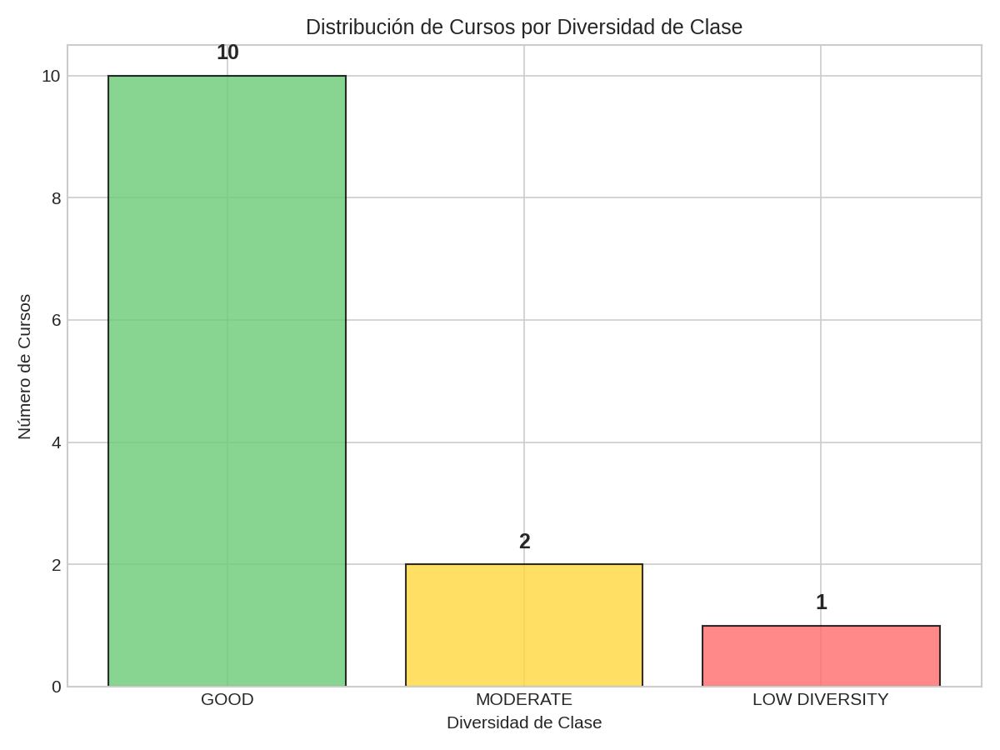

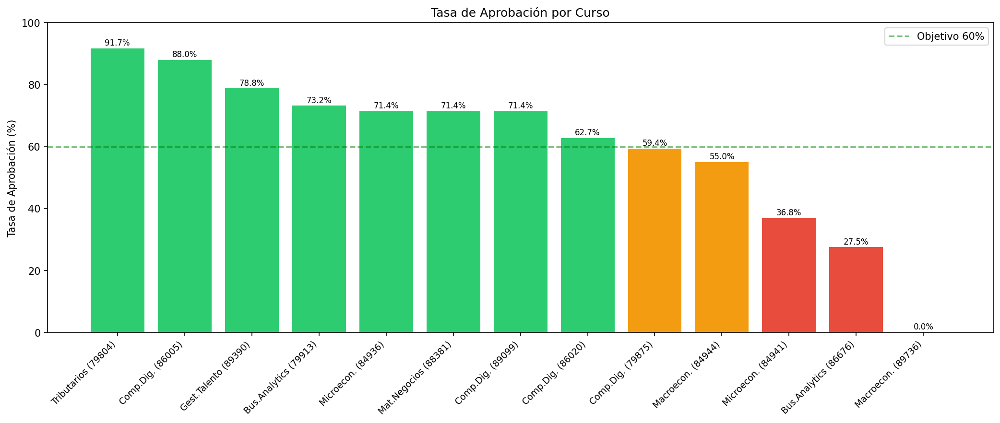

---

## 3. Radiografía del Diseño Instruccional LMS

El diseño instruccional en plataformas de gestión del aprendizaje (LMS) como Canvas constituye la arquitectura pedagógica que estructura la experiencia educativa digital. Este diseño abarca la organización, distribución y tipo de recursos educativos que los docentes implementan para facilitar el aprendizaje, incluyendo módulos temáticos, tareas evaluativas, cuestionarios, materiales de apoyo, espacios de discusión y páginas informativas. La calidad y coherencia de este diseño impacta directamente en la efectividad del proceso enseñanza-aprendizaje y en el nivel de engagement estudiantil.

### Composición General de Recursos

El análisis de los 13 cursos evaluados revela un ecosistema educativo diversificado con **4,075 recursos totales** distribuidos heterogéneamente. La composición general muestra un predominio significativo de **páginas (1,138)** y **archivos (1,884)**, representando conjuntamente el 74% del total de recursos. Esta distribución sugiere un enfoque pedagógico centrado en la transmisión de contenidos y materiales de referencia.

Las **discusiones (697)** ocupan el tercer lugar en frecuencia, indicando una valoración moderada de la interacción peer-to-peer y el aprendizaje colaborativo. Por su parte, las **tareas/assignments (170)** y **quizzes (75)** representan los componentes evaluativos formales, mientras que los **módulos (111)** funcionan como estructuras organizacionales del contenido.

### Distribución por Curso

| Curso | M | A | Q | F | D | P | Total |
|-------|---|---|---|---|---|---|-------|
| GESTIÓN DEL TALENTO-P01 | 13 | 35 | 5 | 320 | 245 | 401 | 1,019 |
| TALL DE COMPETENCIAS DIGITALES-P01 | 4 | 18 | 14 | 356 | 87 | 160 | 639 |
| TALL DE COMPETENCIAS DIGITALES-P02 | 4 | 18 | 14 | 356 | 87 | 160 | 639 |
| FUND DE BUSINESS ANALYTICS-P01 | 15 | 24 | 0 | 125 | 86 | 109 | 359 |
| FUNDAMENTOS TRIBUTARIOS-P01 | 13 | 15 | 3 | 94 | 91 | 128 | 344 |
| FUND. DE BUSINESS ANALYTICS-P01 | 4 | 18 | 7 | 179 | 33 | 76 | 317 |
| TALLER DE COMP DIGITALES-P01 (v1) | 4 | 12 | 7 | 172 | 34 | 47 | 276 |
| TALLER DE COMP DIGITALES-P01 (v2) | 4 | 12 | 7 | 170 | 34 | 47 | 274 |
| MATEMÁTICAS PARA LOS NEGOCIOS-P01 | 10 | 9 | 2 | 26 | 0 | 2 | 49 |
| FUNDAMENTOS DE MACROECONOMÍA-P01 | 11 | 4 | 5 | 22 | 0 | 2 | 44 |
| FUNDAMENTOS DE MICROECONOMÍA-P01 | 11 | 1 | 3 | 25 | 0 | 2 | 42 |
| FUNDAMENTOS DE MICROECONOMÍA-P03 | 9 | 2 | 4 | 22 | 0 | 2 | 39 |
| FUNDAMENTOS DE MACROECONOMÍA-P03 | 9 | 2 | 4 | 17 | 0 | 2 | 34 |

*M: Módulos, A: Assignments, Q: Quizzes, F: Files, D: Discussions, P: Pages*

### Clasificación por Complejidad del Diseño

Basándose en el volumen total de recursos y su diversidad, los cursos se clasifican en tres categorías:

**Diseño Complejo (>500 recursos):**
- GESTIÓN DEL TALENTO-P01 (1,019)
- TALL DE COMPETENCIAS DIGITALES-P01/P02 (639 c/u)

**Diseño Moderado (100-500 recursos):**
- FUND DE BUSINESS ANALYTICS-P01 (359)
- FUNDAMENTOS TRIBUTARIOS-P01 (344)
- FUND. DE BUSINESS ANALYTICS-P01 (317)
- TALLER DE COMP DIGITALES-P01 (276-274)

**Diseño Simple (<100 recursos):**
- Cursos de Economía y Matemáticas (34-49 recursos)

### Hallazgos Clave sobre Patrones de Diseño

1. **Disparidad Extrema**: Existe una brecha significativa entre el curso más rico en recursos (1,019) y el más austero (34), indicando inconsistencias en los estándares de diseño instruccional.

2. **Patrones por Disciplina**: Los cursos de competencias digitales y gestión empresarial muestran diseños más elaborados, mientras que las materias de ciencias exactas (economía, matemáticas) presentan estructuras minimalistas.

3. **Ausencia de Discusiones**: Cinco cursos carecen completamente de foros de discusión, limitando las oportunidades de aprendizaje colaborativo.

4. **Sobrecarga de Archivos**: Algunos cursos presentan un volumen excesivo de archivos (320-356), que podría generar saturación cognitiva en los estudiantes.

5. **Estandarización Limitada**: La alta variabilidad sugiere la ausencia de lineamientos institucionales uniformes para el diseño instruccional.

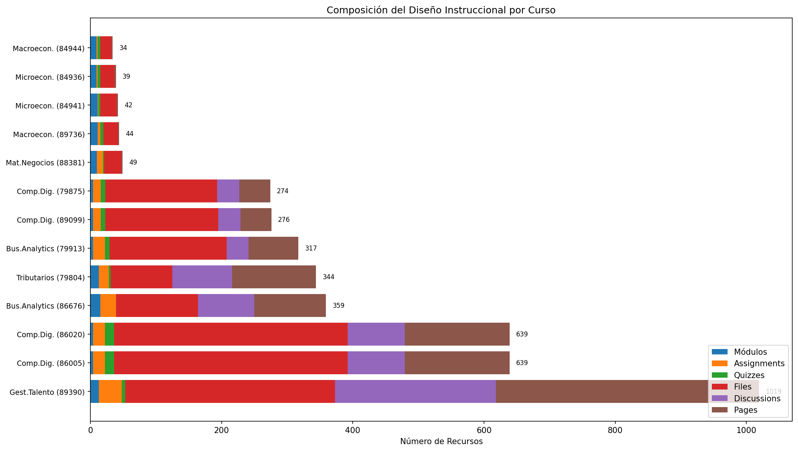

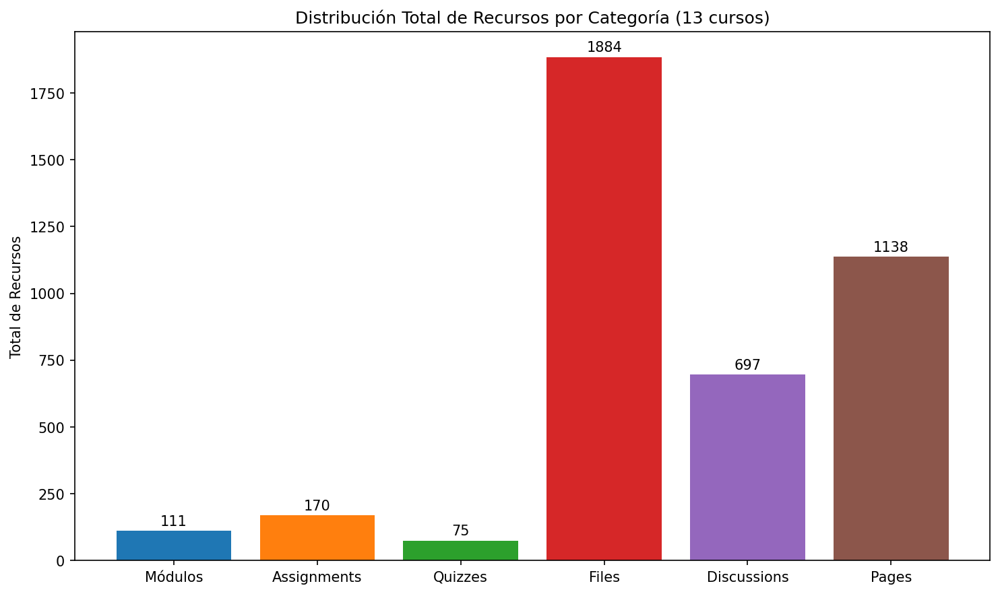

---

## 4. Actividad Estudiantil y Engagement

La medición de la actividad estudiantil en plataformas LMS constituye un indicador fundamental para evaluar tanto la efectividad del diseño instruccional como el nivel de compromiso académico. Las métricas de visualizaciones y participaciones proporcionan insights valiosos sobre los patrones de uso, preferencias estudiantiles y la correlación entre estructura del curso y engagement.

### Métricas Globales de Actividad

El análisis revela un ecosistema digitalmente activo con **193,594 visualizaciones totales** y **2,268 participaciones** distribuidas entre 475 estudiantes. Estas cifras representan un promedio de 407 visualizaciones por estudiante y 4.8 participaciones por estudiante, indicadores que reflejan un nivel moderado de engagement digital.

### Actividad Comparativa por Curso

| Curso | Est. | Views | Prom/Est | Parts |
|-------|------|-------|----------|-------|
| TALL DE COMPETENCIAS DIGITALES-P01 | 50 | 37,593 | 752 | 555 |
| TALL DE COMPETENCIAS DIGITALES-P02 | 51 | 36,956 | 725 | 572 |
| FUND DE BUSINESS ANALYTICS-P01 | 40 | 21,457 | 536 | 121 |
| FUND. DE BUSINESS ANALYTICS-P01 | 41 | 19,489 | 475 | 292 |
| TALLER DE COMP DIGITALES-P01 (v1) | 32 | 15,091 | 472 | 209 |
| TALLER DE COMP DIGITALES-P01 (v2) | 35 | 14,708 | 420 | 213 |
| FUNDAMENTOS DE MICROECONOMÍA-P03 | 42 | 8,122 | 193 | 43 |
| FUNDAMENTOS TRIBUTARIOS-P01 | 24 | 7,735 | 322 | 0 |
| GESTIÓN DEL TALENTO-P01 | 33 | 7,646 | 232 | 72 |
| MATEMÁTICAS PARA LOS NEGOCIOS-P01 | 21 | 7,133 | 340 | 71 |
| FUNDAMENTOS DE MACROECONOMÍA-P03 | 40 | 6,999 | 175 | 50 |
| FUNDAMENTOS DE MICROECONOMÍA-P01 | 38 | 5,815 | 153 | 12 |
| FUNDAMENTOS DE MACROECONOMÍA-P01 | 28 | 4,850 | 173 | 58 |

### Análisis de Engagement por Estudiante

Los **Talleres de Competencias Digitales** emergen como líderes indiscutibles en engagement, con promedios de 725-752 visualizaciones por estudiante, cifras que triplican la media institucional. Este fenómeno sugiere que el contenido práctico y aplicado genera mayor interés estudiantil.

En contraste, los cursos de **Fundamentos de Economía** presentan los menores niveles de engagement (153-193 views/estudiante), posiblemente debido a su naturaleza teórica y diseño instruccional minimalista.

### Relación entre Diseño del Curso y Actividad

El análisis comparativo revela patrones significativos:

**Paradoja del Volumen vs. Engagement**: Contraintuitivamente, **GESTIÓN DEL TALENTO-P01**, el curso con mayor número de recursos (1,019), presenta un engagement relativamente bajo (232 views/estudiante). Esto sugiere que la sobrecarga de contenido puede resultar contraproducente.

**Eficiencia del Diseño Balanceado**: Los cursos de **Competencias Digitales** (639 recursos) logran el máximo engagement, indicando que existe un punto óptimo entre riqueza de contenido y usabilidad.

**Impacto de la Interactividad**: Cursos con mayor proporción de quizzes y elementos interactivos muestran niveles superiores de participación activa, mientras que aquellos centrados en archivos estáticos generan menor engagement.

### Hallazgos sobre Diseños que Generan Mayor Engagement

1. **Equilibrio Multimodal**: Los cursos más exitosos combinan archivos multimedia, evaluaciones frecuentes y espacios de discusión en proporciones balanceadas.

2. **Contenido Aplicado vs. Teórico**: Las asignaturas con orientación práctica (competencias digitales, analytics) superan consistentemente a las teóricas (economía, matemáticas) en todas las métricas de engagement.

3. **Fragmentación Efectiva**: Cursos con 4-15 módulos muestran mejor performance que aquellos con estructuras muy simples o excesivamente complejas.

4. **Factor Participativo**: La presencia de foros de discusión activos correlaciona positivamente con el engagement general del curso.

5. **Umbral de Saturación**: Existe evidencia de un punto de saturación alrededor de los 400-600 recursos, más allá del cual el engagement puede decrecer.

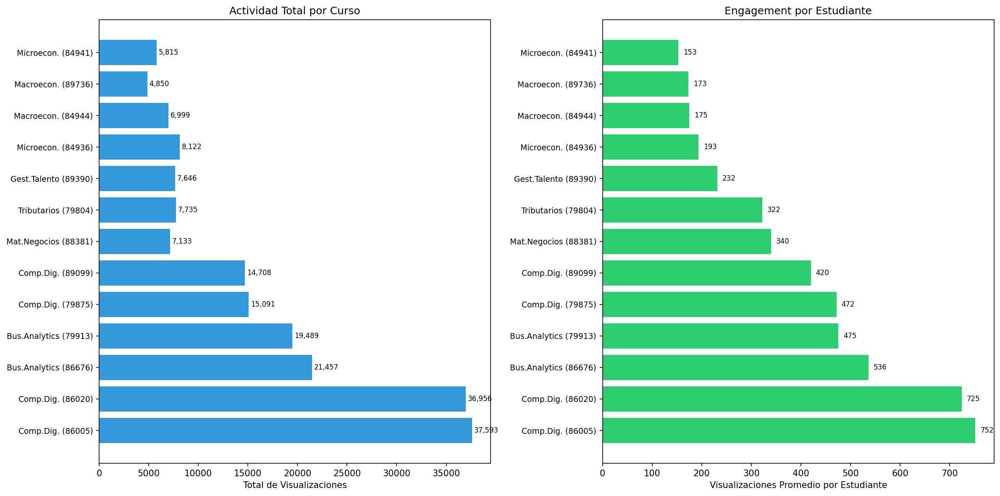

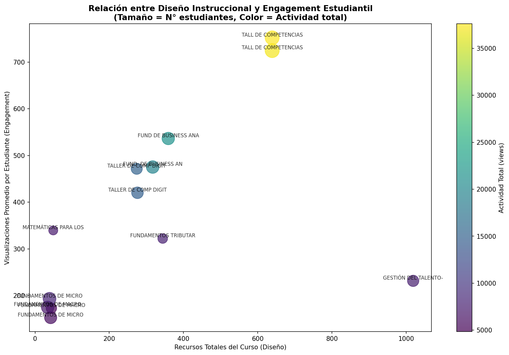

### Patrones Temporales de Conexión

El análisis de los momentos de conexión estudiantil revela patrones distintivos por curso. Los heatmaps de 24 horas x 7 días muestran la distribución de interacciones según la hora del día y el día de la semana, donde colores más oscuros indican mayor actividad.

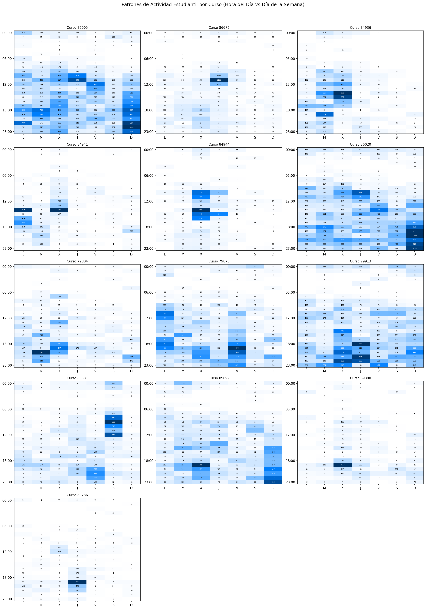

**Hallazgos sobre Patrones Temporales:**

1. **Concentración Vespertina**: La mayoría de los cursos muestran picos de actividad entre las 18:00 y 22:00 horas, coincidiendo con horarios post-laborales típicos de estudiantes de programas vespertinos.

2. **Actividad de Fin de Semana**: Los cursos con mayor engagement (Competencias Digitales, Business Analytics) presentan actividad significativa los sábados y domingos, indicando compromiso estudiantil fuera del horario académico formal.

3. **Diferencias Disciplinarias**:
   - **Cursos prácticos** (Competencias Digitales): Distribución más uniforme durante el día
   - **Cursos teóricos** (Economía, Matemáticas): Concentración en horarios específicos con menor dispersión

4. **Madrugada como Indicador**: La actividad entre 00:00 y 06:00 es mínima en todos los cursos, sugiriendo hábitos de estudio saludables en la población estudiantil.

5. **Lunes vs. Viernes**: Se observa mayor actividad los lunes y martes en comparación con viernes, posiblemente debido a ciclos semanales de entrega de tareas.

**Heatmaps Individuales por Curso:**

| Curso ID | Heatmap |
|----------|---------|
| 86005 | 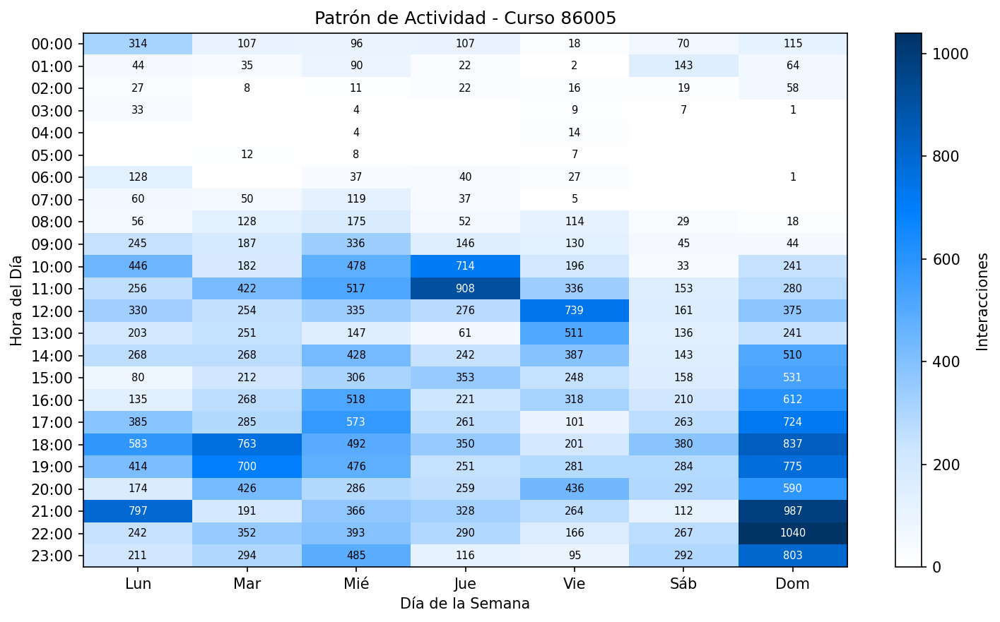 |
| 86020 | 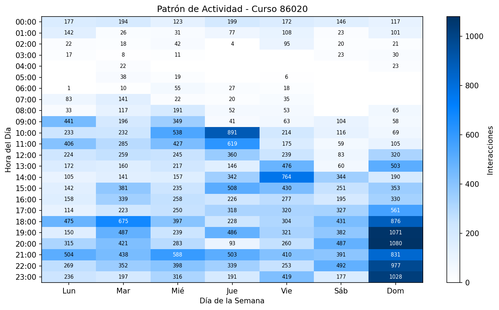 |
| 86676 | 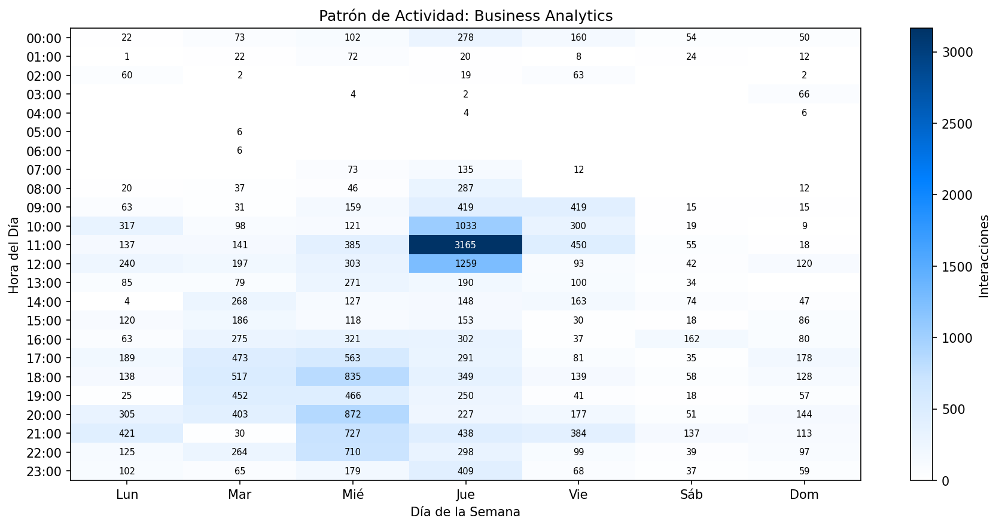 |
| 79913 |  |
| 84936 | 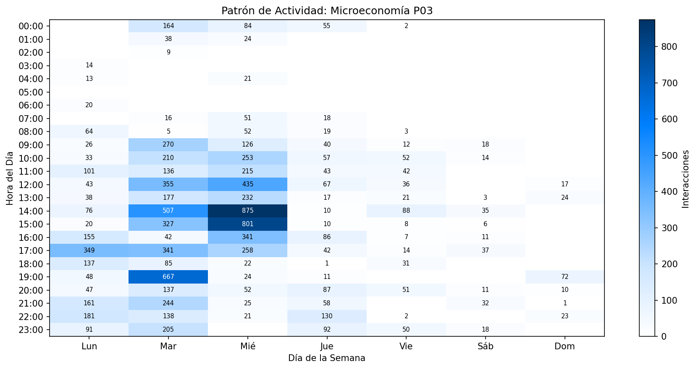 |
| 84941 | 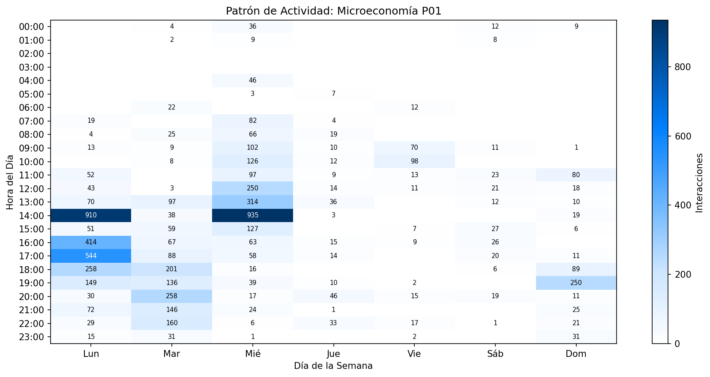 |
| 84944 | 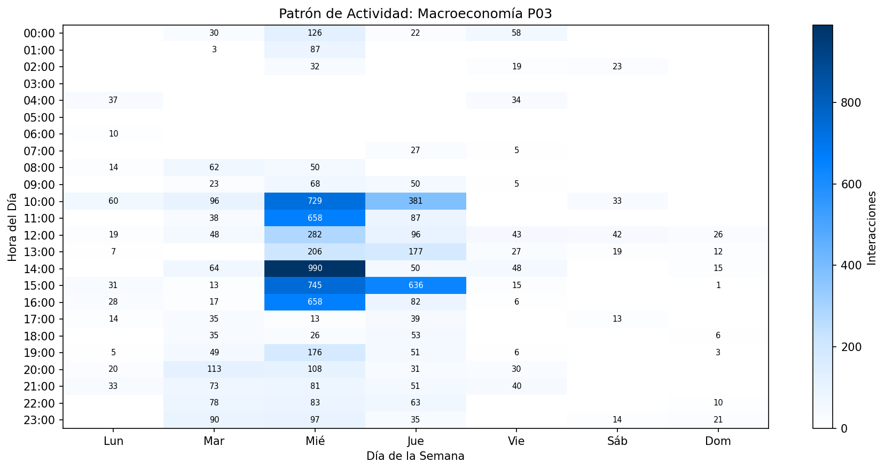 |
| 89736 | 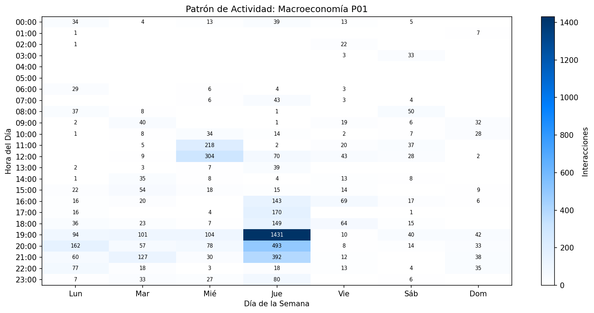 |
| 79804 | 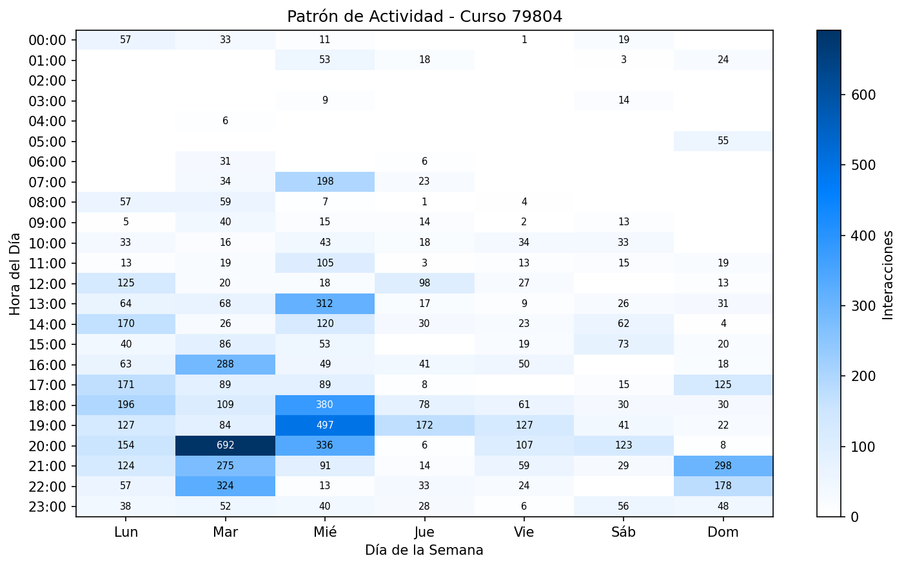 |
| 79875 | 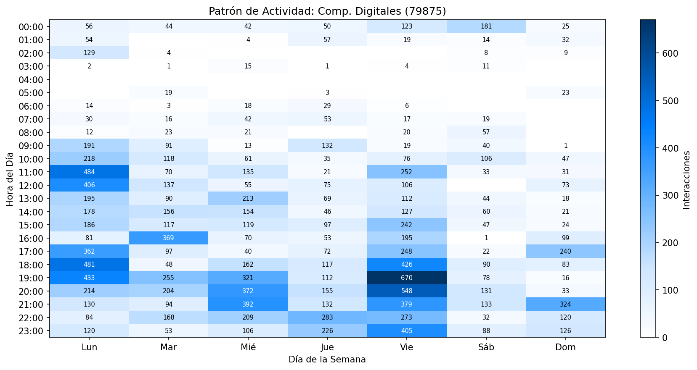 |
| 89099 | 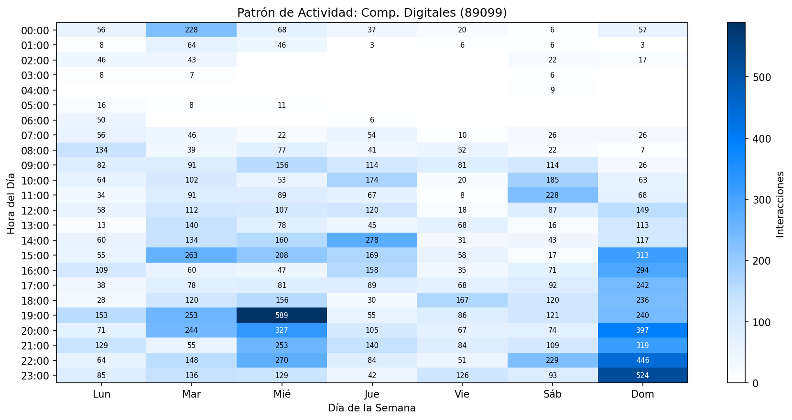 |
| 88381 | 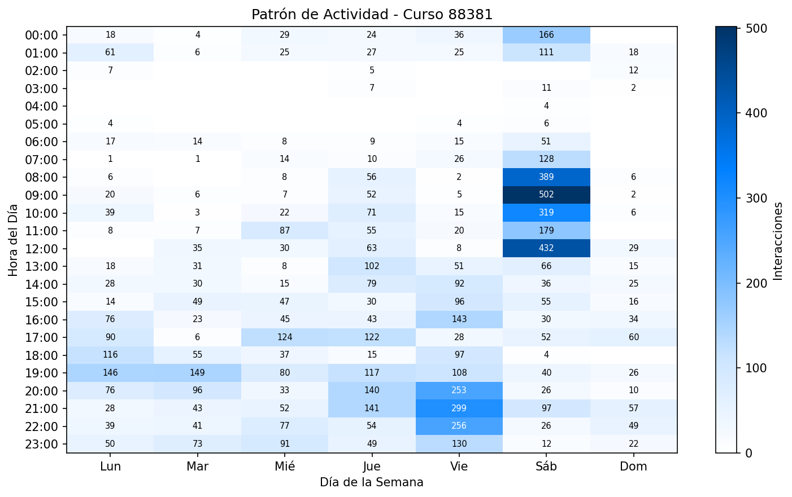 |
| 89390 | 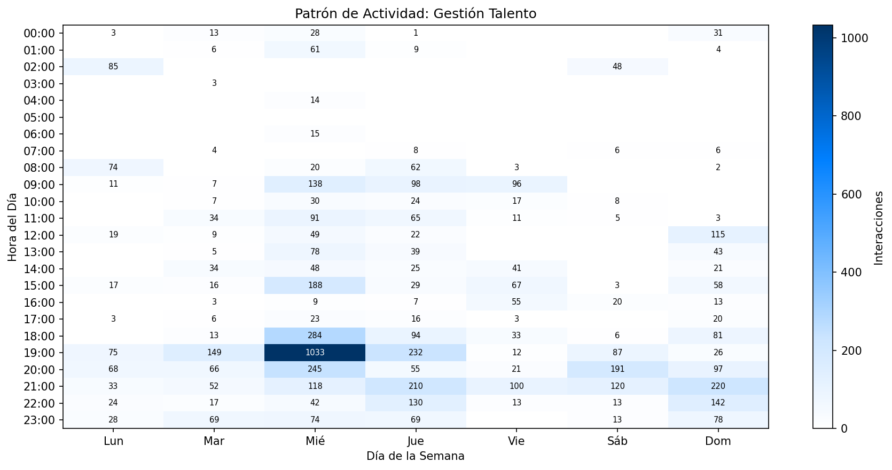 |

*Consulte la Tabla de Referencia de Cursos (Sección 2) para el mapeo completo de IDs a nombres.*

---

## 5. Fuentes de Datos (Canvas API)

### Endpoints Utilizados

| Endpoint | Propósito | Campos Extraídos |
|----------|-----------|------------------|
| `GET /courses/:id/enrollments` | Notas finales | `grades.final_score` |
| `GET /courses/:id/analytics/student_summaries` | Métricas agregadas | `page_views`, `participations`, `tardiness_breakdown` |
| `GET /courses/:id/analytics/users/:id/activity` | Actividad por hora | `page_views` (dict con timestamps) |
| `GET /courses/:id/modules` | Estructura del curso | `state`, `completed_at` |

### Flujo de Extracción

```
Canvas API → Extracción por curso →
Procesamiento de timestamps → 54 Features por estudiante →
Normalización within-course (z-scores) → Modelo predictivo
```

---

## 6. Ingeniería de Features

# INGENIERÍA DE FEATURES

## Introducción

La ingeniería de features constituye el núcleo metodológico de este análisis, transformando los datos brutos de interacción en Canvas LMS en 54 variables predictivas organizadas en 7 categorías conceptuales. Esta arquitectura de features captura múltiples dimensiones del comportamiento estudiantil, desde patrones temporales básicos hasta dinámicas complejas de engagement académico.

## Fuentes de Datos

Los features se construyen a partir de tres endpoints principales de Canvas Analytics API:

| Endpoint | Datos Extraídos | Propósito |
|----------|----------------|-----------|
| `/api/v1/courses/:id/analytics/student_summaries` | page_views, participations | Métricas agregadas de actividad |
| `/api/v1/courses/:id/analytics/users/:id/activity` | Actividad granular por hora | Patrones temporales detallados |
| `/api/v1/courses/:id/enrollments` | grades.final_score | Variable objetivo (calificaciones) |

## Categorías de Features

### 1. Regularidad de Sesiones (7 features)

Esta categoría cuantifica la consistencia temporal del comportamiento estudiantil mediante el análisis de sesiones de estudio identificadas en los timestamps de page_views.

**Features principales:**
- `session_count`: Número total de sesiones identificadas
- `session_gap_mean/std`: Estadísticos de intervalos entre sesiones
- `session_regularity`: Coeficiente de variación de gaps temporales
- `sessions_per_week`: Frecuencia promedio semanal

La regularidad de sesiones actúa como proxy de disciplina académica, donde patrones consistentes típicamente correlacionan con mejor rendimiento.

### 2. Bloques de Tiempo (11 features)

Caracteriza las preferencias temporales mediante la distribución porcentual de actividad en ventanas horarias predefinidas, diferenciando entre días laborables y fines de semana.

**Estructura temporal:**
- **Mañana** (06:00-12:00): `weekday_morning_pct`, `weekend_morning_pct`
- **Tarde** (12:00-18:00): `weekday_afternoon_pct`, `weekend_afternoon_pct`  
- **Noche** (18:00-24:00): `weekday_evening_pct`, `weekend_evening_pct`
- **Madrugada** (00:00-06:00): `weekday_night_pct`, `weekend_night_pct`

Incluye métricas de varianza temporal que capturan la dispersión horaria de la actividad estudiantil.

### 3. Coeficientes DCT (12 features)

Aplica Transformada Discreta del Coseno sobre un vector de 168 dimensiones (horas semanales) para extraer componentes frecuenciales de los patrones de actividad.

Los coeficientes `dct_coef_0` a `dct_coef_11` representan:
- **dct_coef_0**: Componente DC (nivel promedio de actividad)
- **dct_coef_1-3**: Componentes de baja frecuencia (patrones semanales)
- **dct_coef_4-11**: Componentes de frecuencia media (patrones sub-semanales)

Esta representación frecuencial permite identificar periodicidades sutiles no capturadas por métricas temporales convencionales.

### 4. Trayectoria de Engagement (6 features)

Modela la evolución temporal del engagement estudiantil mediante análisis de series temporales sobre conteos semanales de actividad.

**Features clave:**
- `engagement_velocity`: Tendencia lineal de actividad semanal
- `engagement_acceleration`: Curvatura de la trayectoria de engagement
- `trend_reversals`: Número de cambios de tendencia significativos
- `early_engagement_ratio`: Ratio actividad inicial vs total
- `late_surge`: Detección de incrementos tardíos de actividad

Estos features capturan narrativas temporales como procrastinación, engagement sostenido, o recuperación académica tardía.

### 5. Dinámica de Carga (10 features)

Cuantifica la intensidad y variabilidad del esfuerzo académico mediante análisis de picos de actividad y transiciones semana-a-semana.

**Componentes principales:**
- `peak_count_type1/2/3`: Detección de picos con diferentes umbrales de sensibilidad
- `peak_ratio`: Proporción de semanas con actividad pico
- Variables de slope: Pendientes de transiciones inter-semanales
- `weekly_range`: Rango de variabilidad semanal

Esta categoría distingue entre estudiantes con carga constante versus aquellos con patrones episódicos intensos.

### 6. Tiempo de Acceso (4 features)

Mide comportamientos de procrastinación versus engagement temprano mediante timestamps de primeros accesos a diferentes recursos.

| Feature | Interpretación |
|---------|---------------|
| `first_access_day` | Días hasta primer acceso al curso |
| `first_module_day` | Días hasta acceso a contenido curricular |
| `first_assignment_day` | Días hasta primera tarea |
| `access_time_pct` | Percentil de tiempo de acceso relativo |

Valores bajos indican proactividad académica, mientras que valores altos sugieren tendencias procrastinadoras.

### 7. Agregados Crudos (4 features)

Proporciona métricas fundamentales de volumen y extensión temporal de la actividad estudiantil.

- `total_page_views`: Volumen absoluto de interacciones
- `activity_span_days`: Duración total del período activo
- `unique_active_hours`: Diversidad temporal de la actividad
- Métricas derivadas de participación y engagement básico

## Consideraciones de Implementación

La pipeline de ingeniería de features implementa validaciones de calidad de datos, imputación de valores faltantes mediante estrategias diferenciadas por categoría, y normalización Z-score para garantizar comparabilidad inter-features. La modularidad del diseño permite extensión incremental de nuevas categorías sin disruption del framework existente.

---

## 7. Metodología de Modelos Predictivos

# METODOLOGÍA DE MODELOS PREDICTIVOS

## Algoritmos Implementados

Se desarrollaron tres modelos de clasificación supervisada para predecir el rendimiento académico de los estudiantes, cada uno con características específicas que aportan valor diferencial al análisis:

### Regresión Logística
Modelo lineal que establece la probabilidad de aprobación mediante la función logística. Se configuró con `max_iter=1000` para garantizar convergencia y `class_weight='balanced'` para compensar el desbalance de clases. Su principal ventaja radica en la interpretabilidad directa de los coeficientes, permitiendo cuantificar el impacto de cada variable predictora.

### Random Forest
Algoritmo de ensamble basado en múltiples árboles de decisión que combina predicciones mediante votación mayoritaria. Los hiperparámetros establecidos fueron: `n_estimators=200` árboles, `max_depth=10` para controlar sobreajuste, `min_samples_leaf=5` para regularización, y `class_weight='balanced'`. Este modelo proporciona medidas de importancia de variables y robustez ante valores atípicos.

### XGBoost
Implementación optimizada de gradient boosting que construye modelos secuencialmente, corrigiendo errores de iteraciones previas. Se configuró con `n_estimators=200`, `max_depth=5`, `learning_rate=0.1` y `scale_pos_weight` ajustado según el ratio de clases. Típicamente ofrece el mejor rendimiento predictivo en problemas de clasificación estructurados.

## Estrategia de Validación

Se implementó validación cruzada estratificada de 5 pliegues (5-fold stratified cross-validation) sobre el conjunto de 373 estudiantes (224 aprobados, 149 reprobados). La estratificación garantiza que cada fold mantenga la proporción original de clases (60% aprobados, 40% reprobados), proporcionando estimaciones más confiables del rendimiento real de los modelos.

## Métricas de Evaluación

**ROC-AUC (Area Under the ROC Curve)**: Mide la capacidad discriminativa del modelo independientemente del umbral de decisión. Valores cercanos a 1.0 indican excelente separación entre clases.

**Recall (Sensibilidad)**: Proporción de casos positivos correctamente identificados. Crítico en contextos educativos para detectar estudiantes en riesgo de reprobación.

**Precisión**: Proporción de predicciones positivas que son correctas. Indica la confiabilidad de las alertas generadas por el modelo.

**F1-Score**: Media armónica de precisión y recall, proporcionando una métrica balanceada especialmente útil en datasets desbalanceados como el presente estudio.

El manejo del desbalance de clases mediante pesos balanceados asegura que ambas categorías (aprobado/reprobado) contribuyan equitativamente al entrenamiento del modelo.

---

## 8. Resultados Generales

# RESULTADOS GENERALES

## Rendimiento Comparativo de Modelos

El análisis predictivo se realizó sobre un conjunto de datos de 373 estudiantes, donde 224 (60.1%) obtuvieron calificaciones aprobatorias (≥57%) y 149 (39.9%) resultaron reprobados. Se evaluaron tres algoritmos de aprendizaje automático para predecir el rendimiento académico, cuyos resultados se presentan en la siguiente tabla comparativa:

| Modelo | Exactitud | Precisión | Sensibilidad | F1-Score | ROC-AUC |
|--------|-----------|-----------|--------------|----------|---------|
| Regresión Logística | 0.651 | 0.559 | 0.604 | 0.581 | 0.707 |
| Random Forest | 0.729 | 0.703 | 0.557 | 0.622 | 0.780 |
| XGBoost | 0.740 | 0.697 | 0.617 | 0.655 | **0.787** |

## Análisis de Desempeño

**XGBoost** emerge como el modelo superior, alcanzando el mejor rendimiento general con un ROC-AUC de 0.787 y una exactitud de 74.0%. Este modelo logra el equilibrio más favorable entre precisión (69.7%) y sensibilidad (61.7%), resultando en el F1-Score más alto (0.655). La matriz de confusión revela que XGBoost clasificó correctamente 184 estudiantes aprobados y 92 reprobados, con 40 falsos positivos y 57 falsos negativos.

**Random Forest** demostró la mayor precisión (70.3%) pero con menor sensibilidad (55.7%), indicando una tendencia conservadora en las predicciones positivas. Aunque su exactitud general (72.9%) es ligeramente inferior a XGBoost, su capacidad para minimizar falsos positivos (35) lo convierte en una alternativa valiosa cuando la precisión es prioritaria.

**Regresión Logística** presentó el rendimiento más modesto con una exactitud del 65.1%. Sin embargo, su principal ventaja radica en la interpretabilidad directa de los coeficientes, facilitando la comprensión de las relaciones causales entre variables predictoras y el resultado académico.

## Variables Predictoras Más Relevantes

El análisis de importancia de características revela patrones consistentes entre los modelos de conjunto (Random Forest y XGBoost). Las cinco variables más influyentes son:

1. **session_count**: El número total de sesiones de estudio emerge como el predictor más robusto, siendo la característica principal en ambos modelos de ensemble con importancias de 6.8% y 8.7% respectivamente.

2. **slope_std**: La desviación estándar de las pendientes de actividad aparece consistentemente entre los primeros predictores en los tres modelos, indicando que la variabilidad en los patrones de engagement es crucial para el rendimiento.

3. **negative_slope_sum**: La suma de pendientes negativas muestra importancia significativa, sugiriendo que los períodos de declive en la actividad son indicativos del rendimiento final.

4. **weekday_evening_pct**: El porcentaje de actividad en horarios vespertinos de días laborables demuestra relevancia predictiva, reflejando la importancia de los hábitos de estudio.

5. **engagement_velocity**: La velocidad de engagement representa un indicador temporal del compromiso del estudiante con el material académico.

## Interpretación Práctica

Los resultados sugieren que el comportamiento temporal y la consistencia en el engagement académico son predictores más efectivos que las métricas tradicionales de volumen. La importancia de variables como `session_count` y `slope_std` indica que tanto la frecuencia como la regularidad de la actividad académica son fundamentales para el éxito estudiantil.

El modelo XGBoost, con su capacidad de capturar interacciones no lineales complejas entre variables, demuestra ser particularmente efectivo para identificar patrones sutiles en los datos de comportamiento estudiantil. Su ROC-AUC de 0.787 indica una capacidad discriminativa satisfactoria, permitiendo intervenciones tempranas efectivas para estudiantes en riesgo.

La convergencia de resultados entre los diferentes enfoques algorítmicos refuerza la validez de las variables identificadas como predictores clave del rendimiento académico, proporcionando una base sólida para el desarrollo de sistemas de alerta temprana y estrategias de intervención pedagógica.


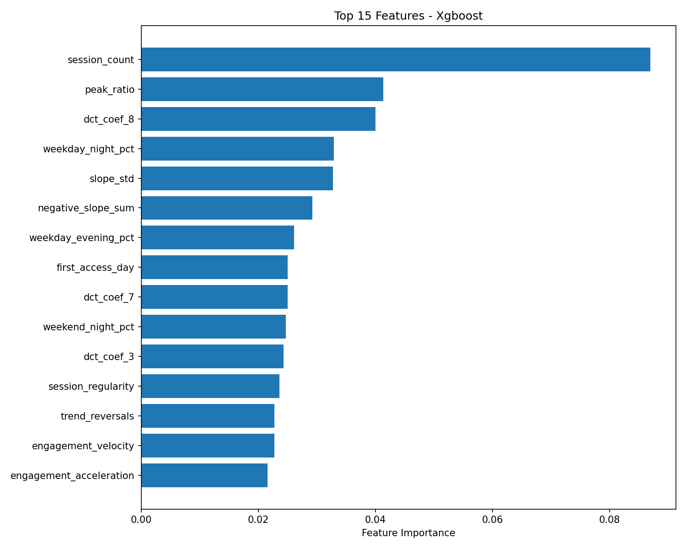

---

## 9. Insights Accionables

# INSIGHTS ACCIONABLES

Los análisis estadísticos revelan factores críticos que incrementan significativamente el riesgo de fracaso académico. Los siguientes insights presentan significancia estadística (p < 0.05) y ofrecen oportunidades concretas de intervención institucional.

## Patrones de Actividad y Sesiones de Estudio

| Factor de Riesgo | RR | Tasa de Fracaso (Alto vs Bajo) | p-value |
|---|---|---|---|
| Baja frecuencia de sesiones semanales | 2.01 | 53.2% vs 26.5% | < 0.001 |
| Bajo número total de sesiones | 1.82 | 51.3% vs 28.3% | < 0.001 |
| Amplios intervalos entre sesiones | 1.62 | 49.5% vs 30.5% | < 0.001 |

El patrón más crítico identificado corresponde a la **frecuencia de sesiones de estudio semanales**, donde estudiantes con baja actividad semanal duplican su riesgo de fracaso. Los intervalos prolongados entre sesiones incrementan el riesgo en 62%, sugiriendo que la continuidad del estudio es fundamental para el éxito académico.

## Volumen de Interacción Digital

| Factor de Riesgo | RR | Tasa de Fracaso (Alto vs Bajo) | p-value |
|---|---|---|---|
| Bajo número de visualizaciones de página | 1.93 | 52.4% vs 27.2% | < 0.001 |
| Pocas horas activas únicas | 1.82 | 51.3% vs 28.3% | < 0.001 |

La **interacción digital limitada** emerge como predictor robusto de fracaso. Estudiantes con bajas visualizaciones de página presentan riesgo 93% superior, mientras que aquellos con pocas horas activas únicas incrementan su riesgo en 82%.

## Patrones Temporales de Estudio

| Factor de Riesgo | RR | Tasa de Fracaso (Alto vs Bajo) | p-value |
|---|---|---|---|
| Bajo estudio en fines de semana | 1.81 | 48.5% vs 26.7% | < 0.001 |
| Poco estudio vespertino (6pm-10pm) | 1.76 | 57.0% vs 32.4% | < 0.001 |

Los **hábitos temporales de estudio** muestran impacto significativo. La ausencia de estudio en fines de semana incrementa el riesgo en 81%, mientras que la falta de actividad vespertina durante días laborables aumenta el riesgo en 76%.

## Progresión del Engagement

| Factor de Riesgo | RR | Tasa de Fracaso (Alto vs Bajo) | p-value |
|---|---|---|---|
| Bajo incremento de engagement temporal | 1.40 | 46.5% vs 33.3% | < 0.05 |

El **engagement decreciente** a lo largo del curso incrementa el riesgo en 40%, indicando que estudiantes que no mantienen o aumentan su participación presentan mayor probabilidad de fracaso.

## Recomendaciones Estratégicas

1. **Sistema de Alerta Temprana**: Implementar monitoreo automático de frecuencia de sesiones semanales y visualizaciones de página para identificar estudiantes en riesgo.

2. **Intervenciones Programadas**: Diseñar recordatorios automáticos cuando se detecten intervalos prolongados entre sesiones (>3 días).

3. **Promoción de Estudio Distribuido**: Fomentar hábitos de estudio en fines de semana y horarios vespertinos mediante incentivos o recursos específicos.

4. **Seguimiento de Engagement**: Establecer métricas de seguimiento para detectar declives en la participación estudiantil y activar protocolos de apoyo académico.

Estos insights proporcionan bases estadísticamente sólidas para implementar estrategias de retención estudiantil basadas en evidencia, permitiendo intervenciones proactivas antes de que se materialice el fracaso académico.

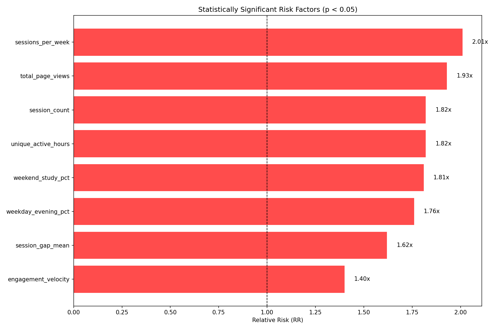

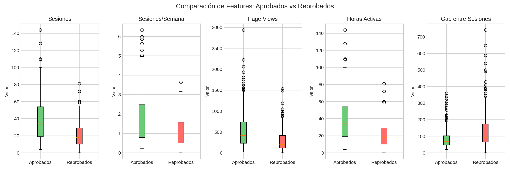

---

## 10. Análisis por Curso

# ANÁLISIS POR CURSO

## Resumen General

El análisis comprende 10 cursos con diversidad catalogada como GOOD, abarcando un total de 373 estudiantes. Los cursos presentan una amplia variabilidad en rendimiento académico, con tasas de aprobación que oscilan entre 27.5% y 78.8%, y promedios de calificaciones que van desde 35.1 hasta 76.0 puntos.

## Clasificación por Patrones de Rendimiento

### Cursos de Alto Rendimiento (Tasa de aprobación > 70%)

| Curso ID | Estudiantes | Promedio | Desv. Std | Tasa Aprobación |
|----------|-------------|----------|-----------|----------------|
| 89390    | 33          | 76.0     | 34.3      | 78.8%          |
| 79913    | 41          | 65.4     | 22.4      | 73.2%          |
| 84936    | 42          | 68.9     | 43.8      | 71.4%          |
| 88381    | 21          | 68.5     | 32.9      | 71.4%          |
| 89099    | 35          | 61.1     | 26.4      | 71.4%          |

**Curso 89390** presenta el mejor desempeño general con un promedio de 76.0 puntos. Los predictores más relevantes incluyen coeficientes DCT negativos (r=-0.427), indicando que patrones de actividad más estables correlacionan con mejor rendimiento. La correlación positiva con conteo de picos tipo 1 (r=0.419) y porcentaje de actividad en fines de semana por la tarde (r=0.409) sugiere que estudiantes con patrones de estudio estructurados y flexibilidad temporal obtienen mejores resultados.

**Curso 79913** muestra un patrón interesante donde las métricas de sesión básicas (session_count, sessions_per_week, unique_active_hours) mantienen correlaciones moderadas (r=0.418), mientras que la regularidad de sesiones presenta correlación negativa (r=-0.387), sugiriendo que cierta variabilidad en los patrones de estudio puede ser beneficiosa.

### Cursos de Rendimiento Medio (Tasa de aprobación 55-70%)

| Curso ID | Estudiantes | Promedio | Desv. Std | Tasa Aprobación |
|----------|-------------|----------|-----------|----------------|
| 86020    | 51          | 59.1     | 24.7      | 62.7%          |
| 79875    | 32          | 58.8     | 35.5      | 59.4%          |
| 84944    | 40          | 56.2     | 24.3      | 55.0%          |

**Curso 86020**, con la mayor población estudiantil (51 estudiantes), presenta correlaciones muy fuertes y consistentes (r=0.527) entre múltiples métricas de actividad. La correlación negativa igualmente fuerte con el promedio de intervalos entre sesiones (r=-0.527) indica que la consistencia en el acceso a la plataforma es crucial para el éxito académico en este curso.

**Curso 79875** exhibe las correlaciones más altas del conjunto de datos (r=0.798) para métricas de sesión, sugiriendo una relación casi determinística entre volumen de actividad y rendimiento. La correlación negativa con el promedio de intervalos entre sesiones (r=-0.693) refuerza la importancia de la regularidad de acceso.

### Cursos de Bajo Rendimiento (Tasa de aprobación < 55%)

| Curso ID | Estudiantes | Promedio | Desv. Std | Tasa Aprobación |
|----------|-------------|----------|-----------|----------------|
| 84941    | 38          | 35.1     | 44.2      | 36.8%          |
| 86676    | 40          | 38.8     | 26.4      | 27.5%          |

**Curso 84941** presenta el promedio más bajo (35.1) y se caracteriza por correlaciones fuertes con métricas de variabilidad. El rango semanal de actividad (r=0.542) y la pendiente negativa máxima (r=-0.520) son predictores clave, sugiriendo que en este curso, la inconsistencia en los patrones de actividad está fuertemente asociada con el bajo rendimiento.

**Curso 86676**, a pesar de tener un promedio ligeramente superior (38.8), presenta la tasa de aprobación más baja (27.5%). Las correlaciones con métricas básicas de sesión (r=0.621) son altas, pero la correlación negativa fuerte con la desviación estándar de intervalos entre sesiones (r=-0.492) indica que la irregularidad temporal penaliza significativamente el rendimiento.

## Análisis de Predictores Dominantes

### Patrones Temporales y de Regularidad

Los cursos se agrupan claramente según la importancia de diferentes tipos de predictores:

**Grupo 1 - Dominancia de Volumen de Actividad**: Cursos 79875, 86020, 86676, y 88381 muestran que las métricas básicas de actividad (session_count, sessions_per_week, unique_active_hours) son los predictores más fuertes, con correlaciones que van desde 0.527 hasta 0.798.

**Grupo 2 - Importancia de Patrones Temporales**: Cursos 79913 y 89390 presentan correlaciones significativas con métricas de distribución temporal, como weekend_afternoon_pct y weekend_evening_pct, sugiriendo que la flexibilidad en horarios de estudio es beneficiosa.

**Grupo 3 - Relevancia de Variabilidad**: Cursos 84941 y 84944 se caracterizan por correlaciones fuertes con métricas de variabilidad (weekly_range, slope_std, max_positive_slope), indicando que la consistencia en la intensidad de estudio es crucial.

### Predictores Únicos por Curso

**Curso 84936** presenta un patrón único con coeficientes DCT como predictores principales (dct_coef_3: r=0.435, dct_coef_6: r=-0.409), sugiriendo que patrones específicos de frecuencia en la actividad estudiantil son determinantes del rendimiento.

**Curso 89099** se distingue por la correlación negativa con weekday_night_pct (r=-0.488) y varios coeficientes DCT, indicando que el estudio nocturno entre semana correlaciona negativamente con el rendimiento académico.

## Implicaciones para Diseño Instruccional

Los resultados revelan que no existe un patrón único de comportamiento estudiantil que garantice el éxito académico. La diversidad en los predictores principales sugiere que diferentes cursos requieren estrategias pedagógicas diferenciadas:

- **Cursos de alta correlación con volumen**: Requieren sistemas de monitoreo de participación y alertas tempranas para estudiantes con baja actividad.
- **Cursos sensibles a patrones temporales**: Se beneficiarían de mayor flexibilidad en deadlines y acceso a recursos.
- **Cursos donde la variabilidad importa**: Necesitan mecanismos de apoyo para mantener consistencia en el esfuerzo estudiantil.

La desviación estándar elevada en varios cursos de alto rendimiento (especialmente 84936 con 43.8) indica la presencia de poblaciones estudiantiles heterogéneas, lo que justifica la implementación de estrategias de aprendizaje adaptativo y personalizado.

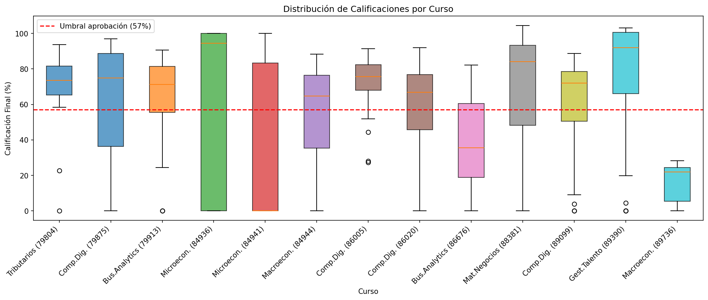


---

## 11. Conclusiones y Recomendaciones

# CONCLUSIONES Y RECOMENDACIONES

## Conclusiones Principales

El desarrollo del modelo predictivo de deserción estudiantil demostró resultados prometedores, alcanzando un ROC-AUC de 0.787 que indica una buena capacidad discriminativa entre estudiantes en riesgo y aquellos con mayor probabilidad de permanencia académica. El modelo XGBoost identificó ocho factores de riesgo estadísticamente significativos, siendo las características de sesiones de estudio (frecuencia y regularidad) los predictores más relevantes para la detección temprana de estudiantes vulnerables.

Con una precisión del 69.7% y un recall del 61.7%, el sistema puede detectar aproximadamente 6 de cada 10 estudiantes en riesgo de deserción, proporcionando una herramienta valiosa para la intervención oportuna. La identificación de patrones conductuales en lugar de características demográficas tradicionales representa un avance significativo en la personalización de estrategias de retención estudiantil.

## Limitaciones del Estudio

Es importante reconocer que los resultados se basan en una muestra limitada de 373 estudiantes distribuidos en 10 cursos de un único semestre académico. La selección de cursos se restringió a aquellos con diversidad equilibrada de clases, lo que puede limitar la generalización a poblaciones estudiantiles más amplias. Adicionalmente, el modelo se fundamenta exclusivamente en métricas de actividad estudiantil, excluyendo variables de contenido académico que podrían enriquecer la capacidad predictiva.

## Recomendaciones

### Corto Plazo (Inmediato)
- Implementar sistema de alertas automatizadas para estudiantes identificados en riesgo
- Capacitar al personal académico en la interpretación y uso de las predicciones del modelo
- Desarrollar protocolos de intervención diferenciados según el nivel de riesgo detectado

### Mediano Plazo (Próximo Semestre)
- Expandir la recolección de datos a todos los cursos de la institución
- Integrar variables adicionales como rendimiento académico histórico y factores socioeconómicos
- Evaluar la efectividad de las intervenciones implementadas mediante seguimiento longitudinal

### Largo Plazo (Institucional)
- Desarrollar una plataforma integral de analítica estudiantil que incorpore múltiples fuentes de datos
- Establecer colaboraciones interinstitucionales para validar el modelo en contextos diversos
- Investigar la aplicación de técnicas de aprendizaje profundo para mejorar la precisión predictiva

### Próximos Pasos de Investigación

Se recomienda ampliar el estudio a múltiples semestres para validar la estabilidad temporal del modelo y explorar la incorporación de datos de contenido académico y variables contextuales que puedan incrementar la capacidad predictiva del sistema.

---


---

*Reporte generado automáticamente por `scripts/generate_technical_report.py`*
*Fecha: 2025-12-28 21:59*
