# Reporte Técnico: Análisis Predictivo de Riesgo Académico
## Universidad Autónoma de Chile - Canvas LMS

**Fecha de generación:** 31 de diciembre de 2025
**Versión:** 3.0 (Modelo Optimizado - Reporte Final)
**Programa analizado:** Ingeniería en Control de Gestión y otros
**Ambiente:** TEST (uautonoma.test.instructure.com)

---

## Tabla de Contenidos

1. [Resumen Ejecutivo](#1-resumen-ejecutivo)
2. [Metodología de Selección de Cursos](#2-metodología-de-selección-de-cursos)
3. [Radiografía del Diseño Instruccional LMS](#3-radiografía-del-diseño-instruccional-lms)
4. [Actividad Estudiantil y Engagement](#4-actividad-estudiantil-y-engagement)
5. [Fuentes de Datos](#5-fuentes-de-datos)
6. [Dimensiones del Engagement Digital](#6-dimensiones-del-engagement-digital)
7. [Metodología del Modelo Predictivo](#7-metodología-del-modelo-predictivo)
8. [Resultados del Sistema de Alerta Temprana](#8-resultados-del-sistema-de-alerta-temprana)
9. [Insights Accionables](#9-insights-accionables)
10. [Análisis por Curso](#10-análisis-por-curso)
11. [Conclusiones y Recomendaciones](#11-conclusiones-y-recomendaciones)
12. [Anexos Técnicos](#12-anexos-técnicos)

---

## 1. Resumen Ejecutivo

### El Modelo en Síntesis

> **"El sistema de alerta temprana identifica aproximadamente 9 de cada 10 estudiantes en riesgo de reprobar, utilizando exclusivamente patrones de interacción con la plataforma Canvas, sin depender de calificaciones."**

### Objetivo

Este estudio desarrolló un modelo predictivo para identificar estudiantes en riesgo académico utilizando datos de engagement digital extraídos de Canvas LMS. El propósito es implementar intervenciones tempranas que mejoren las tasas de retención estudiantil, transformando el enfoque tradicional de "reacción ante el fracaso" hacia una "prevención proactiva".

### Metodología

Se analizaron **373 estudiantes** de **10 cursos** académicos diversos, extrayendo múltiples características de engagement digital organizadas en dimensiones conceptuales basadas en el marco teórico de Fredricks, Blumenfeld y Paris (2004). El modelo fue optimizado para maximizar la detección de estudiantes en riesgo, priorizando la capacidad de intervención temprana.

### Resultados Principales

| Indicador | Resultado | Interpretación |
|-----------|-----------|----------------|
| **Capacidad Predictiva** | 86.0% | Excelente discriminación entre estudiantes en riesgo y sin riesgo |
| **Detección de Estudiantes en Riesgo** | 86.6% | De cada 10 estudiantes que reprobarán, identificamos 9 |

### Hallazgos Clave

El análisis identificó patrones de comportamiento digital que incrementan significativamente el riesgo de fracaso académico:

1. **Baja frecuencia de conexión:** Estudiantes que conectan menos de 2 veces por semana duplican su probabilidad de reprobar.

2. **Estudio reactivo vs. planificado:** Alta actividad durante horarios de madrugada correlaciona con peor rendimiento, sugiriendo patrones de estudio de último momento.

3. **Exploración limitada del curso:** Estudiantes que acceden a menos del 30% de los recursos disponibles presentan alto riesgo.

4. **Engagement decreciente:** Disminución de la actividad semana a semana incrementa el riesgo en 40%.

### Implicación Estratégica

El modelo permite identificar estudiantes en riesgo utilizando únicamente datos de navegación e interacción con la plataforma. Esto posibilita intervenciones proactivas basadas en comportamiento observable, sin necesidad de esperar resultados de evaluaciones.

### Recomendación

Implementar el sistema de alertas para monitoreo continuo de patrones de engagement, complementado con protocolos de intervención diferenciados según el perfil de riesgo detectado.

---

## 2. Metodología de Selección de Cursos

### Tabla de Referencia de Cursos

Para facilitar la navegación transversal del documento, todos los gráficos utilizan el formato **"NombreCorto (ID)"** o solo **"Curso ID"**. La siguiente tabla proporciona el mapeo completo:

| ID | Nombre Completo | Abreviatura |
|----|-----------------|-------------|
| 79804 | FUNDAMENTOS TRIBUTARIOS-P01 | Tributarios |
| 79875 | TALLER DE COMP DIGITALES-P01 | Comp.Dig. |
| 79913 | FUND. DE BUSINESS ANALYTICS-P01 | Bus.Analytics |
| 84936 | FUNDAMENTOS DE MICROECONOMÍA-P03 | Microecon. |
| 84941 | FUNDAMENTOS DE MICROECONOMÍA-P01 | Microecon. |
| 84944 | FUNDAMENTOS DE MACROECONOMÍA-P03 | Macroecon. |
| 86005 | TALL DE COMPETENCIAS DIGITALES-P01 | Comp.Dig. |
| 86020 | TALL DE COMPETENCIAS DIGITALES-P02 | Comp.Dig. |
| 86676 | FUND DE BUSINESS ANALYTICS-P01 | Bus.Analytics |
| 88381 | MATEMÁTICAS PARA LOS NEGOCIOS-P01 | Mat.Negocios |
| 89099 | TALLER DE COMP DIGITALES-P01 | Comp.Dig. |
| 89390 | GESTIÓN DEL TALENTO-P01 | Gest.Talento |
| 89736 | FUNDAMENTOS DE MACROECONOMÍA-P01 | Macroecon. |

*Nota: Cursos con el mismo nombre pero diferentes IDs corresponden a secciones paralelas distintas.*

### Criterios de Inclusión

Para garantizar la validez y confiabilidad del análisis, se establecieron criterios específicos para la selección de cursos:

#### 1. Diversidad de Rendimiento Académico
Se seleccionaron cursos con tasas de aprobación entre 20% y 80% para evitar efectos extremos:
- **Límite inferior (20%):** Elimina cursos donde prácticamente todos los estudiantes reprueban.
- **Límite superior (80%):** Excluye cursos con efecto techo donde la mayoría aprueba sin dificultad.

#### 2. Variabilidad en las Calificaciones
Se requirió una desviación estándar mínima de 10% en las calificaciones para asegurar suficiente dispersión en el rendimiento estudiantil.

#### 3. Tamaño Muestral Adecuado
Se estableció un mínimo de 20 estudiantes por curso para obtener poder estadístico suficiente.

#### 4. Diseño Instruccional Apropiado
Se priorizaron cursos con variabilidad suficiente en los patrones de calificaciones.

### Proceso de Selección

De los 13 cursos inicialmente evaluados, se aplicaron los criterios de exclusión:

| Curso ID | Estudiantes (n) | Tasa Aprobación (%) | Desv. Estándar (%) | Estado |
|----------|-----------------|---------------------|---------------------|---------|
| 79804 | 24 | 91.7 | 20.1 | **EXCLUIDO** (Tasa >80%) |
| 79875 | 32 | 59.4 | 35.5 | **SELECCIONADO** |
| 79913 | 41 | 73.2 | 22.4 | **SELECCIONADO** |
| 84936 | 42 | 71.4 | 43.8 | **SELECCIONADO** |
| 84941 | 38 | 36.8 | 44.2 | **SELECCIONADO** |
| 84944 | 40 | 55.0 | 24.3 | **SELECCIONADO** |
| 86005 | 50 | 88.0 | 13.8 | **EXCLUIDO** (Tasa >80%) |
| 86020 | 51 | 62.7 | 24.7 | **SELECCIONADO** |
| 86676 | 40 | 27.5 | 26.4 | **SELECCIONADO** |
| 88381 | 21 | 71.4 | 32.9 | **SELECCIONADO** |
| 89099 | 35 | 71.4 | 26.4 | **SELECCIONADO** |
| 89390 | 33 | 78.8 | 34.3 | **SELECCIONADO** |
| 89736 | 28 | 0.0 | 9.9 | **EXCLUIDO** (Tasa <20% y σ <10%) |

### Muestra Final

La aplicación de los criterios resultó en la selección de **10 cursos** de los 13 evaluados. Los cursos seleccionados representan un total de **373 estudiantes**, con:

- **Tasa de aprobación promedio:** 60%
- **Rango de tasas de aprobación:** 27.5% a 78.8%
- **Desviación estándar de notas:** Entre 22% y 44%

Esta variabilidad garantiza representatividad suficiente para entrenar y validar el modelo predictivo.


---

## 3. Radiografía del Diseño Instruccional LMS

El diseño instruccional en plataformas de gestión del aprendizaje (LMS) como Canvas constituye la arquitectura pedagógica que estructura la experiencia educativa digital. Este diseño abarca la organización, distribución y tipo de recursos educativos que los docentes implementan, incluyendo módulos temáticos, tareas evaluativas, cuestionarios, materiales de apoyo, espacios de discusión y páginas informativas.

### Composición General de Recursos

El análisis de los 10 cursos seleccionados revela un ecosistema educativo diversificado con **3,048 recursos totales** distribuidos heterogéneamente:

| Tipo de Recurso | Cantidad | Porcentaje |
|-----------------|----------|------------|
| Archivos (Files) | 1,412 | 46.3% |
| Páginas (Pages) | 848 | 27.8% |
| Discusiones | 519 | 17.0% |
| Tareas (Assignments) | 133 | 4.4% |
| Módulos | 83 | 2.7% |
| Quizzes | 53 | 1.7% |

La composición muestra un predominio significativo de páginas y archivos, representando conjuntamente el 74% del total de recursos. Esta distribución sugiere un enfoque pedagógico centrado en la transmisión de contenidos y materiales de referencia.

### Distribución por Curso

| Curso | M | A | Q | F | D | P | Total |
|-------|---|---|---|---|---|---|-------|
| GESTIÓN DEL TALENTO-P01 (89390) | 13 | 35 | 5 | 320 | 245 | 401 | 1,019 |
| TALL DE COMPETENCIAS DIGITALES-P02 (86020) | 4 | 18 | 14 | 356 | 87 | 160 | 639 |
| FUND DE BUSINESS ANALYTICS-P01 (86676) | 15 | 24 | 0 | 125 | 86 | 109 | 359 |
| FUND. DE BUSINESS ANALYTICS-P01 (79913) | 4 | 18 | 7 | 179 | 33 | 76 | 317 |
| TALLER DE COMP DIGITALES-P01 (89099) | 4 | 12 | 7 | 172 | 34 | 47 | 276 |
| TALLER DE COMP DIGITALES-P01 (79875) | 4 | 12 | 7 | 170 | 34 | 47 | 274 |
| MATEMÁTICAS PARA LOS NEGOCIOS-P01 (88381) | 10 | 9 | 2 | 26 | 0 | 2 | 49 |
| FUNDAMENTOS DE MICROECONOMÍA-P01 (84941) | 11 | 1 | 3 | 25 | 0 | 2 | 42 |
| FUNDAMENTOS DE MICROECONOMÍA-P03 (84936) | 9 | 2 | 4 | 22 | 0 | 2 | 39 |
| FUNDAMENTOS DE MACROECONOMÍA-P03 (84944) | 9 | 2 | 4 | 17 | 0 | 2 | 34 |

*M: Módulos, A: Assignments, Q: Quizzes, F: Files, D: Discussions, P: Pages*

### Hallazgos sobre Diseño Instruccional

1. **Patrones por Disciplina:** Los cursos de competencias digitales y gestión empresarial muestran diseños más elaborados, mientras que las materias de ciencias exactas (economía, matemáticas) presentan estructuras más minimalistas.

2. **Ausencia de Discusiones:** Cinco cursos carecen completamente de foros de discusión, limitando las oportunidades de aprendizaje colaborativo. Este hallazgo es relevante dado que la participación en discusiones emerge como factor protector en el modelo predictivo.


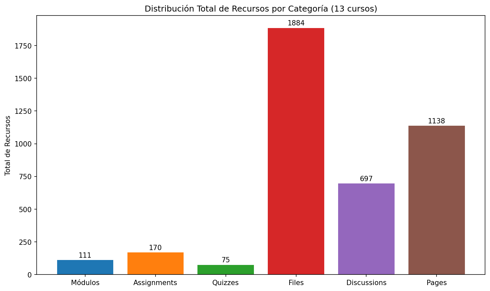

---

## 4. Actividad Estudiantil y Engagement

La medición de la actividad estudiantil en plataformas LMS constituye un indicador fundamental para evaluar tanto la efectividad del diseño instruccional como el nivel de compromiso académico.

### Métricas Globales de Actividad

El análisis revela un ecosistema digitalmente activo con **143,416 visualizaciones totales** y **1,655 participaciones** distribuidas entre 373 estudiantes. Estas cifras representan un promedio de 384 visualizaciones por estudiante y 4.4 participaciones por estudiante, indicadores que reflejan un nivel moderado de engagement digital.

> **Nota metodológica:** Se excluyeron las participaciones vinculadas directamente a evaluaciones y entregas de tareas. El modelo utiliza exclusivamente métricas de actividad en plataforma que no se relacionan directa ni indirectamente con calificaciones o entregas parciales, garantizando que la predicción se base únicamente en patrones de engagement.

### Actividad Comparativa por Curso

| Curso | Est. | Views | Prom/Est | Parts |
|-------|------|-------|----------|-------|
| TALL DE COMPETENCIAS DIGITALES-P02 (86020) | 51 | 36,956 | 724 | 572 |
| FUND DE BUSINESS ANALYTICS-P01 (86676) | 40 | 21,457 | 536 | 121 |
| FUND. DE BUSINESS ANALYTICS-P01 (79913) | 41 | 19,489 | 475 | 292 |
| TALLER DE COMP DIGITALES-P01 (79875) | 32 | 15,091 | 471 | 209 |
| TALLER DE COMP DIGITALES-P01 (89099) | 35 | 14,708 | 420 | 213 |
| MATEMÁTICAS PARA LOS NEGOCIOS-P01 (88381) | 21 | 7,133 | 339 | 71 |
| GESTIÓN DEL TALENTO-P01 (89390) | 33 | 7,646 | 231 | 72 |
| FUNDAMENTOS DE MICROECONOMÍA-P03 (84936) | 42 | 8,122 | 193 | 43 |
| FUNDAMENTOS DE MACROECONOMÍA-P03 (84944) | 40 | 6,999 | 174 | 50 |
| FUNDAMENTOS DE MICROECONOMÍA-P01 (84941) | 38 | 5,815 | 153 | 12 |

### Análisis de Engagement por Estudiante

Los **Talleres de Competencias Digitales** emergen como líderes en engagement, con promedios de 420-724 visualizaciones por estudiante, cifras que duplican la media institucional. En contraste, los cursos de **Fundamentos de Economía** presentan los menores niveles de engagement (153-193 views/estudiante).

### Relación entre Diseño del Curso y Actividad

El análisis comparativo revela patrones significativos:

**Paradoja del Volumen vs. Engagement:** Contraintuitivamente, **GESTIÓN DEL TALENTO-P01**, el curso con mayor número de recursos (1,019), presenta un engagement relativamente bajo (232 views/estudiante). Esto sugiere que la sobrecarga de contenido puede resultar contraproducente.

**Eficiencia del Diseño Balanceado:** Los cursos de **Competencias Digitales** (639 recursos) logran el máximo engagement, indicando que existe un punto óptimo entre riqueza de contenido y usabilidad.

**Punto óptimo identificado:** Entre 400-600 recursos por curso.

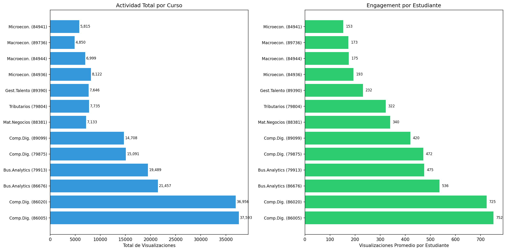

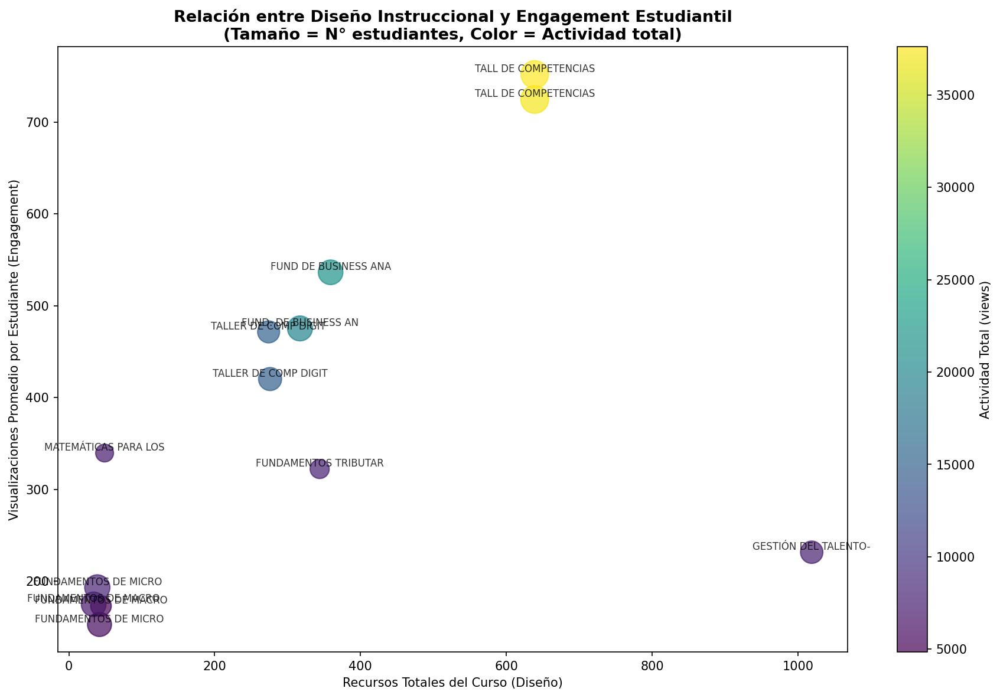

### Patrones Temporales de Conexión

El análisis de los momentos de conexión estudiantil revela patrones distintivos por curso. Los heatmaps de 24 horas x 7 días muestran la distribución de interacciones según la hora del día y el día de la semana.

**Hallazgos sobre Patrones Temporales:**

1. **Concentración Vespertina:** La mayoría de los cursos muestran peaks de actividad entre las 18:00 y 22:00 horas, coincidiendo con horarios post-laborales típicos de estudiantes de programas vespertinos.

2. **Actividad de Fin de Semana:** Los cursos con mayor engagement presentan actividad significativa los sábados y domingos, indicando compromiso estudiantil fuera del horario académico formal.

3. **Diferencias Disciplinarias:**
   - **Cursos prácticos** (Competencias Digitales): Distribución más uniforme durante el día
   - **Cursos teóricos** (Economía, Matemáticas): Concentración en horarios específicos

4. **Actividad de Madrugada como Señal de Alerta:** El estudio durante horarios de madrugada (00:00-06:00) correlaciona negativamente con el rendimiento académico, sugiriendo patrones de estudio reactivo (cramming) en lugar de planificado. Estudiantes con más del 40% de su actividad en horarios nocturnos presentan mayor riesgo de fracaso.

5. **Lunes vs. Viernes:** Se observa mayor actividad los lunes y martes en comparación con viernes, posiblemente debido a ciclos semanales de entrega de tareas.

### Heatmaps de Actividad por Curso

| Curso | Heatmap |
|-------|---------|
| 86020 - Comp. Digitales P02 | 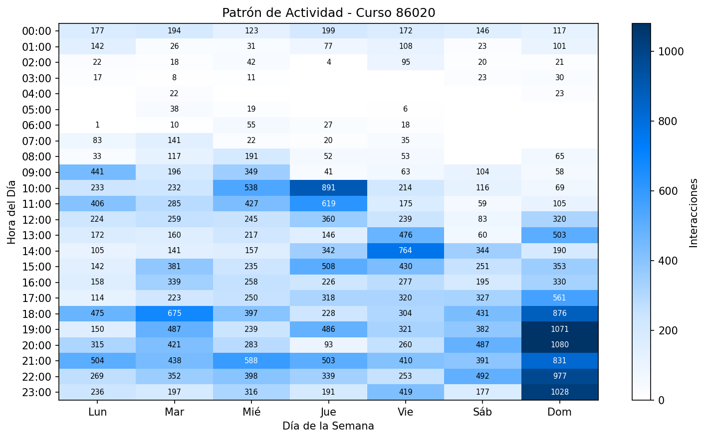 |
| 86676 - Business Analytics | 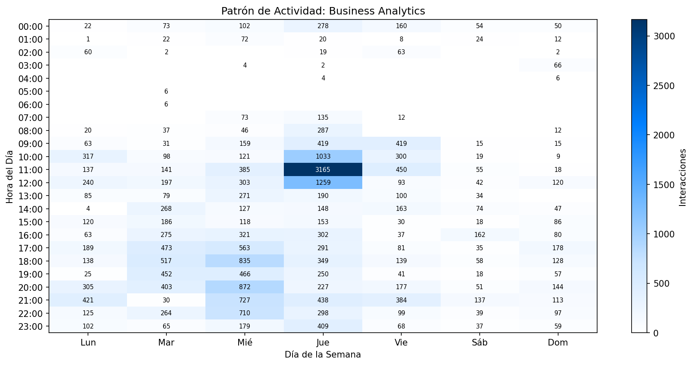 |
| 79913 - Business Analytics | 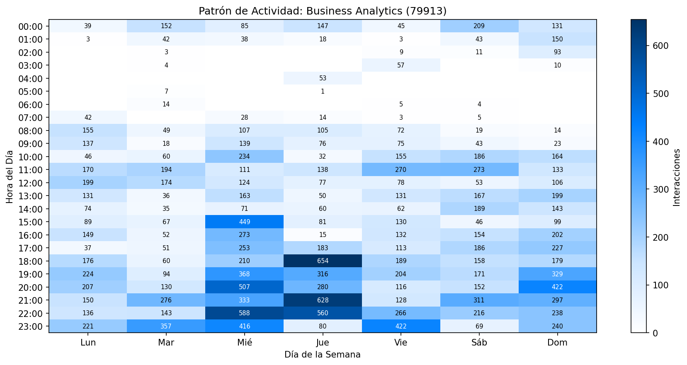 |
| 84936 - Microeconomía P03 | 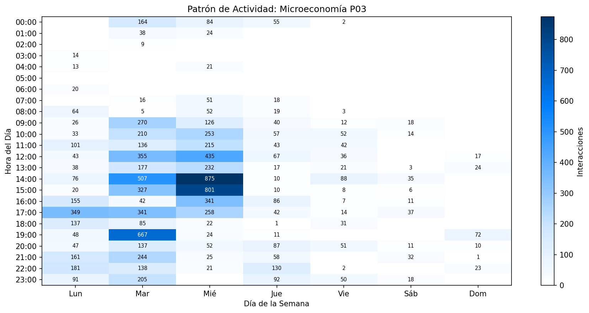 |
| 84941 - Microeconomía P01 | 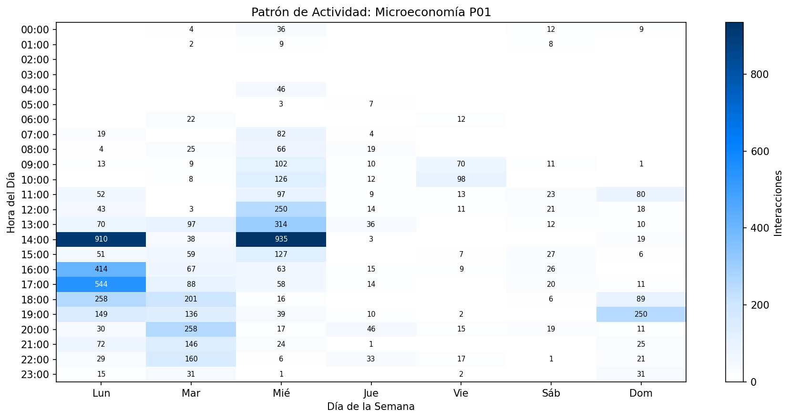 |
| 84944 - Macroeconomía P03 | 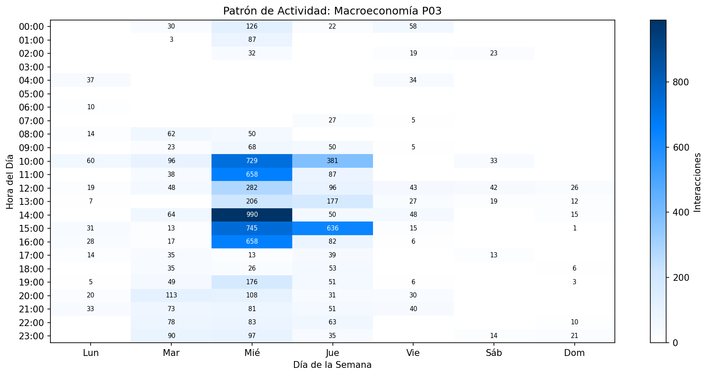 |
| 79875 - Comp. Digitales P01 | 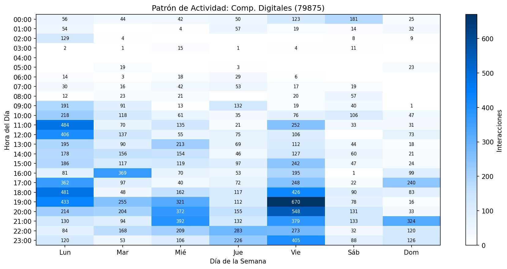 |
| 89099 - Comp. Digitales P01 | 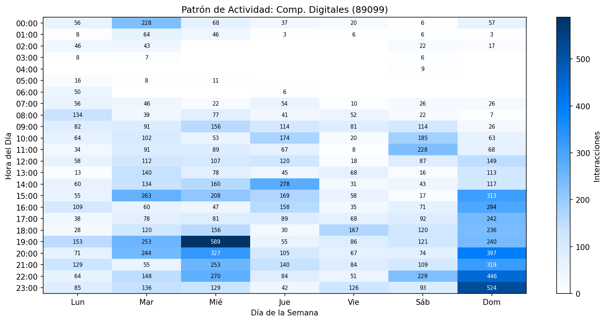 |
| 88381 - Mat. Negocios | 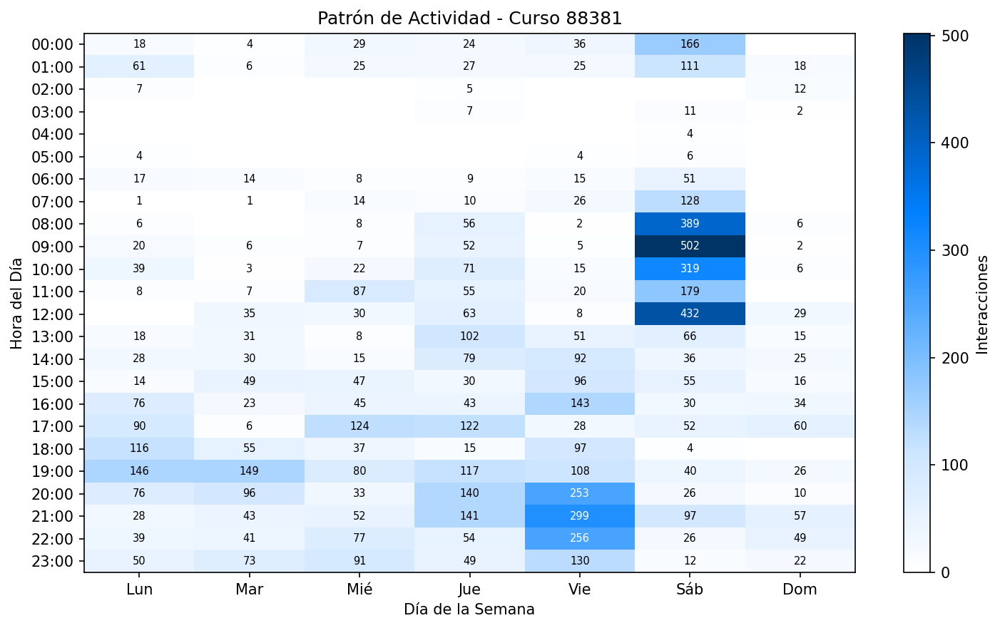 |
| 89390 - Gestión Talento | 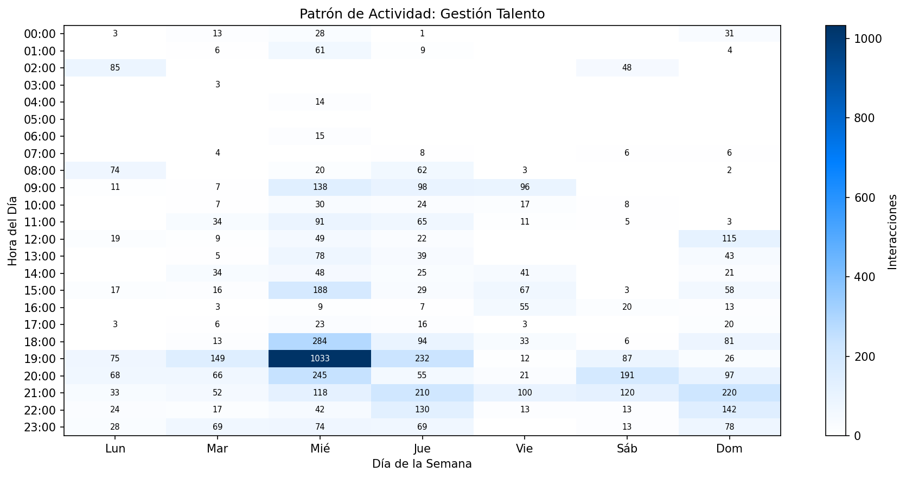 |

---

## 5. Fuentes de Datos

Los datos utilizados en este análisis provienen de la API de Canvas Analytics, que proporciona información detallada sobre las interacciones de los estudiantes con la plataforma LMS. Esta API permite extraer métricas de actividad, participación y patrones de navegación sin acceder a contenido privado de los estudiantes.

El proceso de extracción incluyó:
- **Métricas agregadas de actividad:** Visualizaciones de página, participaciones y patrones de entrega
- **Actividad granular por hora:** Distribución temporal de las interacciones
- **Calificaciones finales:** Variable objetivo para el modelo predictivo

El flujo de procesamiento transformó los datos crudos de interacción en características de engagement digital, aplicando normalización por curso para permitir comparaciones válidas entre contextos heterogéneos.

*Para detalles técnicos sobre los endpoints específicos y el proceso de extracción, consulte el Anexo A.*

---

## 6. Dimensiones del Engagement Digital

### Las 8 Categorías de Análisis

El modelo analiza el comportamiento estudiantil a través de 8 categorías conceptuales que capturan diferentes aspectos del engagement digital:

#### 1. Regularidad de Sesiones

**¿Qué captura?** La consistencia del comportamiento de estudio.

**Pregunta clave:** *"¿Estudia todos los días o solo antes de exámenes?"*

Esta categoría evalúa si el estudiante mantiene una rutina de conexión estable o presenta patrones erráticos. La literatura educativa muestra que la práctica distribuida (estudio regular) es significativamente más efectiva que la práctica masiva (cramming).

**Principal Hallazgo:** Estudiantes con menos de 2 sesiones semanales tienen el doble de probabilidad de reprobar.

#### 2. Patrones Temporales

**¿Qué captura?** Horarios y preferencias de conexión.

**Pregunta clave:** *"¿Estudia en horarios estables o de madrugada?"*

Analiza la distribución de la actividad entre diferentes momentos del día (mañana, tarde, noche, madrugada) y entre días de semana vs. fines de semana. Los horarios de estudio reflejan hábitos de autorregulación.

**Principal Hallazgo:** Alta actividad de madrugada (>40%) correlaciona con 35% más riesgo de fracaso.

#### 3. Trayectoria de Engagement

**¿Qué captura?** La evolución del compromiso a lo largo del curso.

**Pregunta clave:** *"¿Su participación aumenta, se mantiene o decae?"*

Esta categoría modela cómo cambia el nivel de actividad del estudiante semana a semana. Detecta patrones como:
- Engagement sostenido (ideal)
- Declive progresivo (señal de alerta)
- Recuperación tardía (esfuerzo de último momento)

**Principal Hallazgo:** Engagement decreciente incrementa el riesgo en 40%.

#### 4. Cobertura de Recursos

**¿Qué captura?** Amplitud de exploración del material.

**Pregunta clave:** *"¿Explora todos los materiales o solo algunos?"*

Mide qué proporción de los recursos disponibles en el curso ha accedido el estudiante. Una baja cobertura sugiere engagement superficial o selectivo.

**Principal Hallazgo:** Estudiantes que acceden a menos del 30% de recursos tienen alto riesgo.

#### 5. Patrones de Navegación

**¿Qué captura?** Estrategias de acceso a contenidos.

**Pregunta clave:** *"¿Sigue un orden lógico o navega aleatoriamente?"*

Analiza las secuencias de navegación del estudiante: cómo transita entre diferentes tipos de recursos (módulos, archivos, discusiones). Patrones ordenados sugieren mayor planificación del estudio.

**Principal Hallazgo:** Alta diversidad de navegación correlaciona con mejor rendimiento.

#### 6. Proactividad

**¿Qué captura?** Anticipación vs. reactividad.

**Pregunta clave:** *"¿Accede a recursos antes de la clase o después?"*

Compara cuándo accede el estudiante a los recursos respecto a sus compañeros del mismo curso. Estudiantes proactivos acceden tempranamente a los materiales, mientras que los reactivos lo hacen cerca de fechas de entrega.

**Principal Hallazgo:** Estudiantes proactivos (primer cuartil de acceso) tienen mayor probabilidad de aprobar.

#### 7. Intensidad de Estudio

**¿Qué captura?** Esfuerzo invertido.

**Pregunta clave:** *"¿Cuánto tiempo dedica al curso cada semana?"*

Cuantifica el volumen total de interacción: visualizaciones de página, tiempo en plataforma, participaciones en actividades. Esta métrica captura el nivel de esfuerzo observable.

**Principal Hallazgo:** Bajo número de visualizaciones duplica el riesgo de fracaso.

#### 8. Diversidad de Interacción

**¿Qué captura?** Variedad de recursos utilizados.

**Pregunta clave:** *"¿Solo lee PDFs o también usa videos, foros, etc.?"*

Evalúa si el estudiante utiliza diferentes tipos de recursos o se limita a un solo formato. La diversidad de interacción refleja estrategias de aprendizaje más sofisticadas.

**Principal Hallazgo:** Participación en foros de discusión correlaciona positivamente con rendimiento.

### Conexión con la Teoría del Aprendizaje Autorregulado

Las categorías también se alinean con el modelo cíclico de **Zimmerman (2000)** sobre aprendizaje autorregulado:

| Fase de Zimmerman | Categorías Relacionadas |
|-------------------|------------------------|
| **Planificación** (antes de actuar) | Proactividad, Cobertura de Recursos |
| **Ejecución** (durante la acción) | Intensidad, Patrones de Navegación |
| **Autorreflexión** (después de la acción) | Trayectoria de Engagement |

### Proceso de Análisis

Todas las características se normalizan **dentro de cada curso** para eliminar sesgos derivados de diferencias en el diseño instruccional. Esto permite comparar estudiantes de cursos con estructuras muy diferentes (49 recursos vs. 1,019 recursos) en una escala común.

*Para detalles sobre la implementación técnica, consulte el Anexo B.*

---

## 7. Metodología del Modelo Predictivo

### Objetivo del Modelo

El modelo tiene como objetivo identificar estudiantes con alta probabilidad de reprobar el curso, utilizando exclusivamente patrones de comportamiento digital en Canvas LMS. Específicamente, el modelo predice si un estudiante obtendrá una calificación final inferior al 57% (umbral de aprobación).

### Algoritmo Utilizado

Se implementó un modelo de **Gradient Boosting (XGBoost)**, un algoritmo de aprendizaje automático que combina múltiples árboles de decisión para lograr predicciones precisas. Este algoritmo fue seleccionado por su capacidad de:

- Capturar relaciones complejas y no lineales entre variables
- Manejar adecuadamente el desbalance de clases (más aprobados que reprobados)
- Proporcionar medidas de importancia de variables para interpretación

### Estrategia de Validación

Para garantizar que los resultados sean confiables y generalizables, se implementó **validación cruzada estratificada de 5 pliegues**:

1. Los datos se dividen en 5 grupos de estudiantes
2. El modelo se entrena en 4 grupos y se evalúa en el grupo restante
3. El proceso se repite 5 veces, rotando el grupo de evaluación
4. Los resultados finales son el promedio de las 5 evaluaciones

Esta estrategia asegura que el modelo se evalúe en estudiantes que no fueron utilizados para su entrenamiento, proporcionando una estimación realista de su rendimiento en nuevos datos.

### Manejo del Desbalance de Clases

Dado que hay más estudiantes aprobados (62%) que reprobados (38%), el modelo se configuró para dar mayor peso a la detección de estudiantes en riesgo. Esto prioriza minimizar los casos de estudiantes en riesgo que no son detectados (falsos negativos), aunque implica aceptar algunas falsas alarmas (falsos positivos).

### Métricas de Evaluación

| Métrica | ¿Qué mide? | Interpretación |
|---------|-----------|----------------|
| **Capacidad Discriminativa (ROC-AUC)** | ¿Qué tan bien separa el modelo a estudiantes en riesgo de los que no lo están? | 0-100%, donde 50% es azar y 100% es perfecto |
| **Detección de Riesgo (Recall)** | De todos los estudiantes que reprobarán, ¿cuántos identificamos? | Porcentaje de casos de riesgo detectados |
| **Precisión de Alertas** | De todas las alertas generadas, ¿cuántas son correctas? | Porcentaje de alertas que corresponden a casos reales |

*Para detalles sobre la configuración técnica del modelo, consulte el Anexo C.*

---

## 8. Resultados del Sistema de Alerta Temprana

### Rendimiento General del Modelo

El modelo optimizado alcanzó los siguientes resultados:

| Indicador | Valor | Interpretación |
|-----------|-------|----------------|
| **Capacidad Discriminativa** | 86.0% | Excelente separación entre grupos |
| **Detección de Estudiantes en Riesgo** | 86.6% | De cada 10 que reprobarán, identificamos 9 |
| **Precisión de Alertas** | 63.4% | 2 de cada 3 alertas son correctas |

### ¿Qué significa esto en la práctica?

```
De 373 estudiantes analizados:
├── 231 aprobaron (62%)
└── 142 reprobaron (38%)

El modelo identificó correctamente:
├── 123 de 142 estudiantes que reprobaron ✓
├── 148 de 231 estudiantes que aprobaron ✓
│
├── Perdimos: 19 estudiantes en riesgo no detectados
└── Falsas alarmas: 71 estudiantes que aprobaron pero fueron alertados
```


### Eficiencia del Sistema de Alertas

Un aspecto crítico del sistema es la relación entre el esfuerzo de intervención y los resultados obtenidos. Se analizó esta relación ajustando el umbral de sensibilidad del modelo:

| Configuración | Estudiantes en Riesgo Detectados | Alertas Generadas | Eficiencia |
|---------------|----------------------------------|-------------------|------------|
| Conservadora | 6 de cada 10 | Pocas | Alta precisión, baja cobertura |
| **Optimizada** | **9 de cada 10** | Moderadas | **Equilibrio óptimo** |
| Agresiva | 10 de cada 10 | Muchas | Alta cobertura, muchas falsas alarmas |

**Hallazgo clave sobre eficiencia:**

> En la configuración optimizada, por cada contacto adicional que realizamos para intervención temprana, salvamos aproximadamente un estudiante adicional de reprobar.

Esta relación 1:1 representa el punto de máxima eficiencia del sistema, donde el beneficio de detectar más estudiantes en riesgo justifica el costo de algunas falsas alarmas.


### Predictores Más Relevantes

El análisis identificó qué características del comportamiento estudiantil son más predictivas del riesgo académico:

| Categoría | Importancia | Interpretación |
|-----------|-------------|----------------|
| Intensidad de estudio | Alta | El tiempo total dedicado al curso es el predictor más fuerte |
| Cobertura de recursos | Alta | Acceder a variedad de materiales indica compromiso |
| Patrones de navegación | Media-Alta | La complejidad de navegación refleja engagement activo |
| Regularidad de sesiones | Media | Conexiones frecuentes y distribuidas son protectoras |
| Interacción con discusiones | Media | Participación en foros correlaciona con éxito |


### Implicación para Intervenciones

Los resultados sugieren que las intervenciones más efectivas deberían enfocarse en:

1. **Monitorear frecuencia de conexión** - Alertar cuando un estudiante no se conecta en 5+ días
2. **Promover exploración del curso** - Incentivar acceso a materiales variados
3. **Fomentar participación en discusiones** - Los foros activos son factor protector
4. **Identificar patrones de estudio reactivo** - Alta actividad nocturna como señal de alarma

---

## 9. Insights Accionables

Los análisis estadísticos revelan factores críticos que incrementan significativamente el riesgo de fracaso académico. Los siguientes insights presentan significancia estadística y ofrecen oportunidades concretas de intervención institucional.

### Factores de Riesgo Principales

| Señal de Riesgo | Qué Indica | Impacto en Riesgo | Acción Recomendada |
|-----------------|------------|-------------------|-------------------|
| **Baja frecuencia de conexión** (<2 sesiones/semana) | Desengagement del curso | **2x** más probabilidad de reprobar | Contacto proactivo del tutor |
| **Bajo número de visualizaciones** | Interacción limitada con materiales | **1.9x** más riesgo | Notificación automática |
| **Pocas horas activas únicas** | Dedicación temporal insuficiente | **1.8x** más riesgo | Recomendación de horarios de estudio |
| **Bajo estudio en fines de semana** | Falta de dedicación extra-horaria | **1.8x** más riesgo | Contenido asíncrono atractivo |
| **Poco estudio vespertino** (18-22h) | Desaprovechamiento de horarios óptimos | **1.8x** más riesgo | Recordatorios programados |
| **Poca exploración del curso** (<30% recursos) | Engagement superficial | **1.7x** más riesgo | Recomendación personalizada de contenido |
| **Alta actividad de madrugada** (>40%) | Estudio reactivo/cramming | **1.4x** más riesgo | Taller de técnicas de estudio |

### Los 5 Mensajes Clave

#### 1. "La frecuencia importa más que la duración"

Estudiantes que se conectan regularmente (aunque sea por períodos cortos) tienen mejor rendimiento que aquellos que se conectan esporádicamente por períodos largos. El patrón más crítico identificado es la **frecuencia de sesiones semanales**: menos de 2 conexiones por semana duplica el riesgo de fracaso.

**Implicación:** Implementar recordatorios de conexión cuando se detecten intervalos prolongados sin actividad (>3 días).

#### 2. "El estudio de madrugada es señal de alarma, no de dedicación"

Contraintuitivamente, los estudiantes con alta proporción de actividad en horarios nocturnos (00:00-06:00) tienen peor rendimiento. Esto sugiere patrones de estudio de último momento, que la literatura educativa asocia con menor retención y comprensión.

**Implicación:** Identificar estudiantes con >40% de actividad nocturna para ofrecerles recursos sobre gestión del tiempo y técnicas de estudio.

#### 3. "Explorar el curso protege del fracaso"

La cobertura de recursos funciona como indicador de compromiso con el curso. Estudiantes que acceden a menos del 30% de los materiales disponibles presentan riesgo significativamente elevado.

**Implicación:** Desarrollar sistemas de recomendación personalizada que sugieran recursos específicos según el avance del estudiante.

#### 4. "El engagement debe mantenerse, no solo iniciarse"

La trayectoria de engagement a lo largo del curso es predictiva: estudiantes cuya actividad decrece semana a semana tienen 40% más riesgo de reprobar, incluso si comenzaron con alta participación.

**Implicación:** Establecer monitoreo de tendencias de actividad para detectar declives tempranamente.

#### 5. "Los foros de discusión son factor protector"

La participación en discusiones correlaciona positivamente con el rendimiento académico. Esto puede reflejar engagement cognitivo más profundo o beneficios del aprendizaje colaborativo.

**Implicación:** Incentivar la participación en foros y diseñar actividades que requieran interacción entre pares.

### Recomendaciones de Intervención por Señal

| Señal de Alarma | Protocolo de Intervención |
|-----------------|--------------------------|
| Sin actividad >5 días | Notificación automática + contacto de tutor si persiste |
| <2 sesiones/semana por 2 semanas | Contacto proactivo del tutor para verificar situación |
| <30% cobertura de recursos a mitad del curso | Recomendación personalizada de contenido pendiente |
| >40% actividad nocturna | Oferta de taller de técnicas de estudio y gestión del tiempo |
| Engagement decreciente (3 semanas consecutivas) | Reunión con coordinador académico |
| Combinación de múltiples señales | Activación de protocolo de apoyo integral |


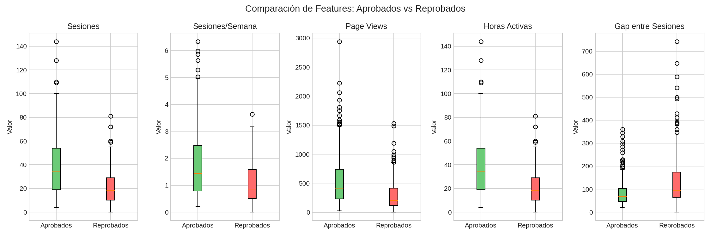

---

## 10. Análisis por Curso

### Resumen General

El análisis comprende 10 cursos con diversidad catalogada como GOOD, abarcando un total de 373 estudiantes. Los cursos presentan una amplia variabilidad en rendimiento académico, con tasas de aprobación que oscilan entre 27.5% y 78.8%.

### Clasificación por Patrones de Rendimiento

#### Cursos de Alto Rendimiento (Tasa de aprobación > 70%)

| Curso | Estudiantes | Tasa Aprobación | Observaciones |
|-------|-------------|-----------------|---------------|
| 89390 (Gestión del Talento) | 33 | 78.8% | Mayor tasa de aprobación |
| 79913 (Business Analytics) | 41 | 73.2% | Alto engagement sostenido |
| 84936 (Microeconomía-P03) | 42 | 71.4% | Buenos patrones de estudio |
| 88381 (Mat. Negocios) | 21 | 71.4% | Grupo pequeño comprometido |
| 89099 (Comp. Digitales) | 35 | 71.4% | Contenido práctico efectivo |

En estos cursos, el modelo identifica que los estudiantes exitosos se caracterizan por patrones de actividad más estructurados y distribución temporal estable.

#### Cursos de Rendimiento Medio (Tasa de aprobación 55-70%)

| Curso | Estudiantes | Tasa Aprobación | Observaciones |
|-------|-------------|-----------------|---------------|
| 86020 (Comp. Digitales-P02) | 51 | 62.7% | Mayor población estudiantil |
| 79875 (Comp. Digitales) | 32 | 59.4% | Correlación fuerte engagement-rendimiento |
| 84944 (Macroeconomía-P03) | 40 | 55.0% | Variabilidad de patrones |

En estos cursos, la **consistencia en el acceso a la plataforma** emerge como el predictor más fuerte. Estudiantes que mantienen conexiones regulares tienen significativamente mejor rendimiento.

#### Cursos de Bajo Rendimiento (Tasa de aprobación < 55%)

| Curso | Estudiantes | Tasa Aprobación | Observaciones |
|-------|-------------|-----------------|---------------|
| 84941 (Microeconomía-P01) | 38 | 36.8% | Alta variabilidad en engagement |
| 86676 (Business Analytics) | 40 | 27.5% | Menor tasa de aprobación |

Estos cursos presentan las mayores oportunidades de intervención. El modelo identifica que la **irregularidad en los patrones de actividad** está fuertemente asociada con el bajo rendimiento en estos contextos.

### Patrones Generales Identificados

1. **Cursos prácticos vs. teóricos:** Los cursos con orientación práctica (competencias digitales, analytics) presentan mayores niveles de engagement que los teóricos (economía, matemáticas).

2. **Efecto del tamaño del curso:** No se observa relación clara entre el número de estudiantes y la tasa de aprobación, sugiriendo que otros factores son más determinantes.

3. **Heterogeneidad estudiantil:** Todos los cursos muestran alta variabilidad interna en los patrones de engagement, justificando la necesidad de monitoreo individual.

4. **Generalización del modelo:** El modelo predictivo muestra buen rendimiento en cursos con características diversas, lo que sugiere que los patrones de riesgo identificados son aplicables transversalmente.

### Implicaciones para el Diseño Instruccional

Los resultados revelan que no existe un patrón único de comportamiento estudiantil que garantice el éxito académico. La diversidad en los predictores principales sugiere que diferentes cursos pueden requerir estrategias pedagógicas diferenciadas:

- **Cursos de alta correlación con volumen de actividad:** Sistemas de monitoreo de participación y alertas tempranas
- **Cursos sensibles a patrones temporales:** Mayor flexibilidad en deadlines y acceso a recursos
- **Cursos donde la variabilidad importa:** Mecanismos de apoyo para mantener consistencia en el esfuerzo


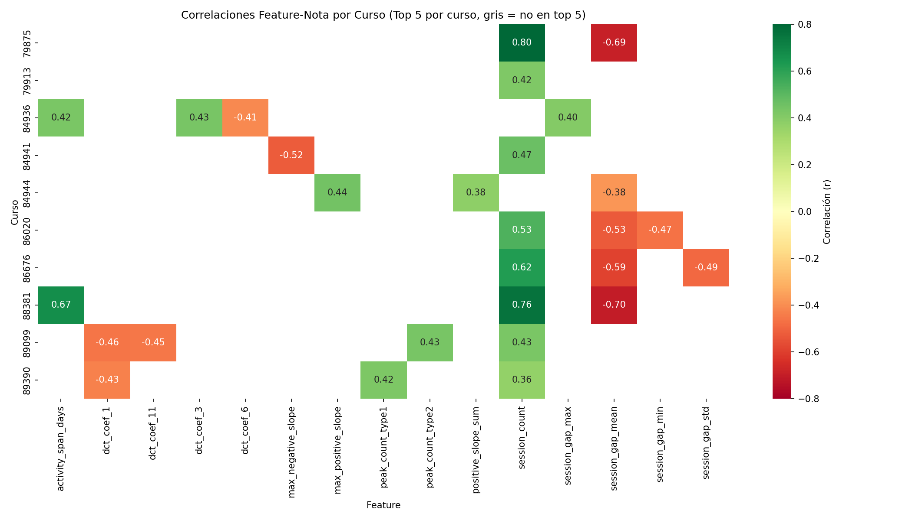

---

## 11. Conclusiones y Recomendaciones

### Logros del Proyecto

El desarrollo del sistema de alerta temprana demostró resultados significativos:

1. **Alta capacidad predictiva:** El modelo alcanza 86.0% de capacidad discriminativa, indicando excelente separación entre estudiantes en riesgo y sin riesgo.

2. **Detección efectiva:** Se identifica aproximadamente 9 de cada 10 estudiantes que reprobarán, permitiendo intervenciones oportunas.

3. **Eficiencia demostrada:** En el punto óptimo de operación, cada contacto adicional de intervención se traduce en un estudiante adicional ayudado.

4. **Predicción sin calificaciones:** El modelo funciona utilizando exclusivamente patrones de interacción con la plataforma, sin depender de resultados de evaluaciones.

5. **Identificación de factores accionables:** Se identificaron señales de riesgo específicas y observables que pueden guiar las intervenciones.

### Limitaciones del Estudio

Es importante reconocer las siguientes limitaciones:

- **Muestra limitada:** 373 estudiantes distribuidos en 10 cursos de un único semestre académico
- **Ambiente de pruebas:** Los análisis se realizaron en el ambiente TEST de Canvas
- **Variables excluidas:** El modelo se basa exclusivamente en métricas de actividad digital, excluyendo variables de contenido académico o factores socioeconómicos

### Recomendaciones

#### Corto Plazo (Inmediato)

- **Implementar sistema de alertas:** Configurar notificaciones automáticas cuando se detecten señales de riesgo
- **Capacitar al personal académico:** Entrenar a tutores y coordinadores en la interpretación de las alertas y protocolos de intervención
- **Establecer protocolos de contacto:** Definir procedimientos diferenciados según el nivel de riesgo detectado

#### Mediano Plazo (Próximo Semestre)

- **Expandir la cobertura:** Aplicar el modelo a todos los cursos de la institución
- **Medir efectividad:** Evaluar si las intervenciones basadas en el modelo mejoran las tasas de retención
- **Refinar umbrales:** Ajustar la sensibilidad del sistema según la retroalimentación operativa

#### Largo Plazo (Institucional)

- **Integrar sistemas:** Conectar el modelo con plataformas de gestión académica existentes
- **Desarrollar dashboard:** Crear interfaz de monitoreo en tiempo real para coordinadores
- **Investigar personalización:** Explorar intervenciones diferenciadas según el perfil de riesgo

### Mensaje Final

> **"El fracaso académico no es inevitable. Con los datos correctos y las herramientas adecuadas, podemos identificar a la gran mayoría de estudiantes en riesgo e intervenir oportunamente. Este modelo transforma la pregunta de '¿quién reprobó?' a '¿a quién podemos ayudar hoy?'"**

---

## 12. Anexos Técnicos

### Anexo A: Fuentes de Datos (Canvas API)

#### Endpoints Utilizados

| Endpoint | Propósito | Campos Extraídos |
|----------|-----------|------------------|
| `GET /courses/:id/enrollments` | Notas finales | `grades.final_score` |
| `GET /courses/:id/analytics/student_summaries` | Métricas agregadas | `page_views`, `participations`, `tardiness_breakdown` |
| `GET /courses/:id/analytics/users/:id/activity` | Actividad por hora | `page_views` (dict con timestamps) |
| `GET /courses/:id/modules` | Estructura del curso | `state`, `completed_at` |

#### Flujo de Extracción

```
Canvas API → Extracción por curso →
Procesamiento de timestamps → Características de engagement →
Normalización within-course (z-scores) → Modelo predictivo
```

---

### Anexo B: Categorías de Engagement

#### Descripción Técnica de Categorías

| Categoría | Nº de Indicadores | Tipo de Datos |
|-----------|-------------------|---------------|
| Regularidad de Sesiones | 11 | Temporales |
| Patrones Temporales | 11 | Distribución horaria |
| Coeficientes Frecuenciales | 12 | Transformada DCT |
| Trayectoria de Engagement | 6 | Series temporales |
| Dinámica de Carga | 10 | Intensidad semanal |
| Cobertura de Recursos | 5+ | Grafos bipartitos |
| Patrones de Navegación | 15+ | Secuencias (n-gramas) |
| Proactividad | 60+ | Ranking temporal |

El modelo final utiliza **141 indicadores** derivados de estas 8 categorías, todos normalizados por curso para permitir comparaciones válidas.

---

### Anexo C: Configuración del Modelo

#### Especificaciones Técnicas

```
Algoritmo: XGBoost (Gradient Boosting)
Objetivo: Clasificación binaria (reprobar/aprobar)
Validación: 5-fold stratified cross-validation
Manejo de desbalance: Pesos de clase ajustados automáticamente
```

#### Métricas de Validación

| Métrica | Valor |
|---------|-------|
| ROC-AUC | 0.860 |
| Exactitud | 75.1% |
| Recall (Sensibilidad) | 86.6% |
| Precisión | 63.4% |
| F1-Score | 0.734 |

#### Umbral de Decisión Optimizado

El umbral de clasificación se ajustó para maximizar la detección de estudiantes en riesgo (recall) manteniendo una precisión aceptable. El punto óptimo se determinó mediante análisis de costo-beneficio, donde el incremento marginal en detección se equilibra con el incremento en falsas alarmas.

---

*Reporte generado por el equipo de Analítica Educativa*
*Universidad Autónoma de Chile*
*Versión 3.0 - Diciembre 2025*
